:showtitle:
:toc: left
:numbered:
:icons: font

= Testing details: 2020-11 edition

See RFD 110 for context and a summary of key results.

See the adjacent link:testing-details.adoc[Testing Details] document for the initial set of tests completed.

After discussing the results of those tests internally and meeting with Cockroach Labs, we ran another round of key tests.  These are described here.  Highlighted changes:

* Switched to OSS builds of CockroachDB v20.2.0 release candidates, instead of standard builds of a commit from July.
* Switched to i3.2xlarge instances for most of this testing.
* We did a `cockroach dump` test under no load.
* We did a rolling upgrade test under light load from v20.2.0 RC3 to v20.2.0 RC4.  There's almost no change in this build, but this did exercise the process.
* For the expansion/contraction tests, we traced fsync latency.

Again, for more context, see those other two documents.

== Common configuration

Unless otherwise specified, we used the same configuration as in the previous "Testing Details" report.

**CockroachDB:** all testing described here used OSS builds of CockroachDB v20.2.0, either RC3, RC4, or the final release.  For the final release, we patched our build to include https://github.com/cockroachdb/cockroach/pull/56591[a fix we submitted upstream to a bug that we found in the OSS build web UI].

**Operating system:** illumos (OmniOS) built by jclulow, uname `omnios-r151034-b3d6e2addc`, AMI `ami-0bc33ade03d07d4d3`.

**Filesystem:** ZFS, using stock configuration plus `compression=on`.  Single-device zpool built atop the local NVME device.

**Tuning:** We did essentially no tuning, including of CockroachDB (including its cache size), ZFS, the networking stack, or anything else.

**Infrastructure:** AWS, using EC2 and EBS.  Specific instance types and volume types varied by test.

**Workloads:** All testing was done with `cockroach workload run kv`, the "kv" workload described https://www.cockroachlabs.com/docs/v20.1/cockroach-workload.html#workloads[here].  We stuck with this workload because it seems like the simplest for CockroachDB -- if it didn't work, that would reflect a problem.

**Instance types (CPU, memory, I/O):** i3.2xlarge for the database instances.  These have 61 GiB of memory, 8 VCPUs, and one 1700 GiB NVME storage device.  We avoided the latest generation of instance types ("c5" and "m5") because they rely on ENA support from the guest OS, which isn't currently supported on illumos.

**Data collection:** our key metrics are the client-side throughput and latency reported by the `cockroach workload` tool using per-second data with HDR latency histograms.  Errors are reported in the stdout from `cockroach workload`.  We also recorded the latency of every fsync on the system using DTrace.  We also have data exported by CockroachDB and illumos in Prometheus format; however, the time resolution is significantly more limited than these other sources.  This data is collected in 10-second buckets, and so useful graphs can only be created with a time resolution of 40 seconds or so.

**Raw notes and data:** very raw notes from each test are in the "raw_notes" file in the cockroachdb-exploration repository.  Some raw data is available in the "data" directory of that repo.

== Setup: creating a relatively large database

On 2020-11-09 we deployed a new 3-node cluster using an OSS build of v20.2.0 RC3.  As before, we used this workload:

[source,text]
----
cockroach workload run kv --init --concurrency 4 --display-every=60s --batch 10 --max-block-bytes 1024 --min-block-bytes 1024 postgresql://root@192.168.1.52:26257/kv?sslmode=disable &
----

We ran one instance of this command for each of the three nodes in the cluster.

This creates a database "kv" with a table "kv" with two columns, one of which contains 1 KiB of random data.  We stopped when the ZFS usage reached about 124 GiB of space on each node (about 2x DRAM).

== Rolling upgrade test

We wanted to do a rolling upgrade under a light load to verify that in the happy case, cluster availability and performance are not significantly affected by the upgrade.

We ran this to start a _light_ workload against each of the three nodes:

[source,text]
----
date="$(date +%FT%TZ)"
for node in 52 159 43; do
	cockroach workload run kv --histograms kv-histograms-$node-$date.out --concurrency 4 --max-rate=333 --display-every=1s --read-percent 80 --tolerate-errors postgresql://root@192.168.1.$node:26257/kv?sslmode=disable > loadgen-summary-$node-$date.out 2>&1 &
done
----

Timeline:

[source,text]
----
2020-11-10T16:40:09Z workload started
2020-11-10T23:13:24Z upgrade node 1 started (finished at 23:13:55Z)
2020-11-10T23:15:54Z upgrade node 3 started (finished at 23:17:54Z)*
2020-11-10T23:19:26Z upgrade node 2 started (finished at 23:21:38Z)*
----

For the second and third nodes, the shutdown step timed out after 60s and SMF killed the process with `SIGKILL`.  The CockroachDB documentation explains that this timeout may need to be tuned higher than 60s and we should investigate this, but it doesn't seem like a problem right now.

Here's a graph of overall read and write throughput to all three nodes during this period:

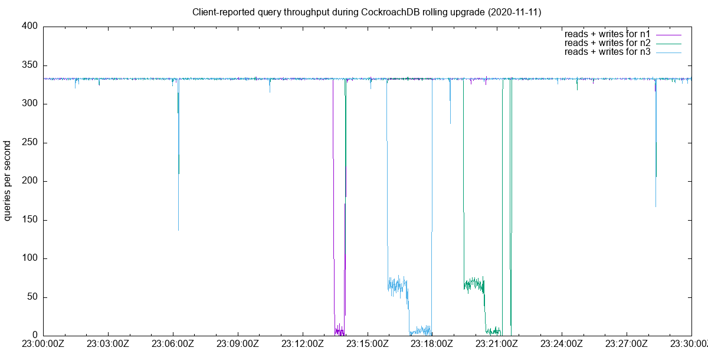

If we can drill down into each node and break out by read vs. write, we see that for n2 and n3, during that minute during which we were waiting for the node to shut down, writes were still completing, but reads went to zero:

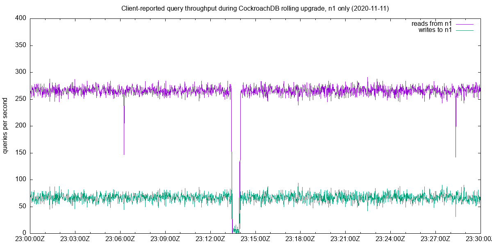

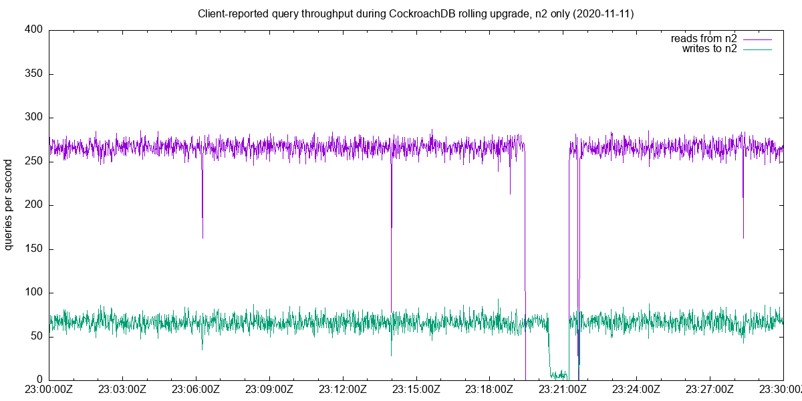

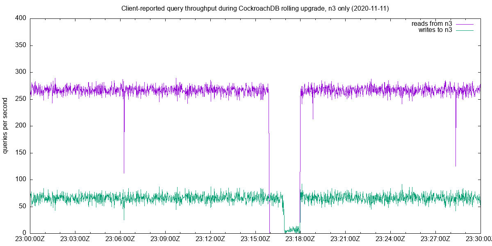

This is somewhat curious, but not obviously a problem.

Let's look at latency for each node as we do the rolling upgrade.  We'll look at pMax, as it's a worse case than p99, but both plots look very similar.

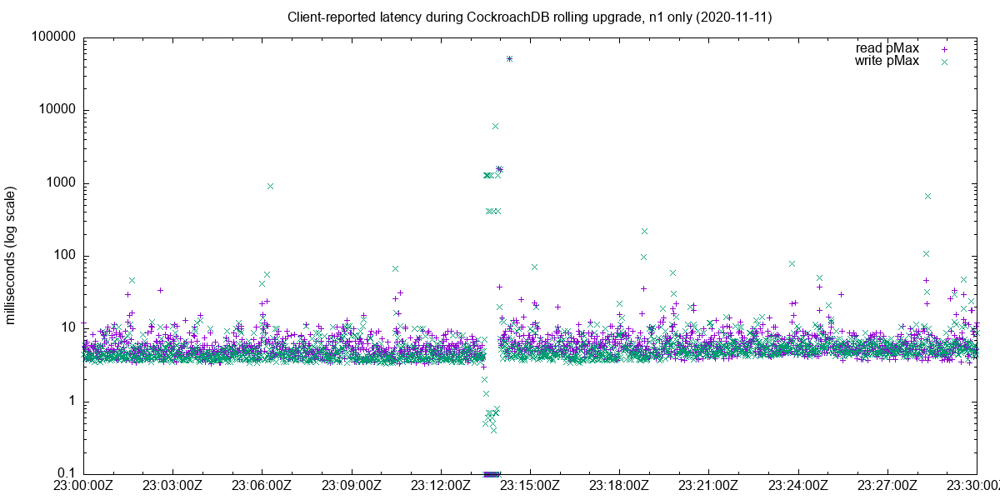

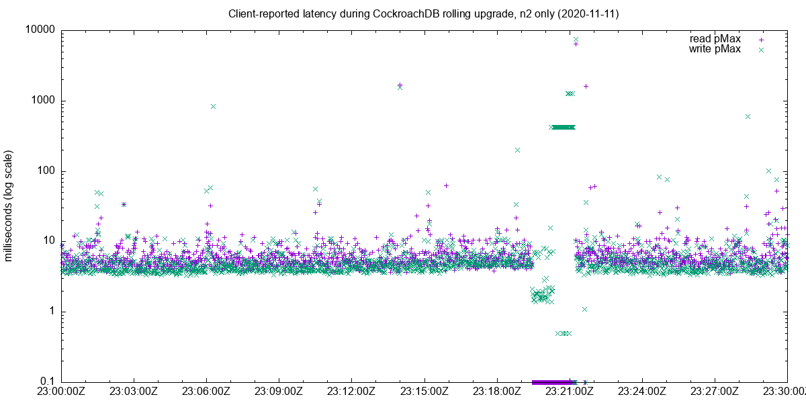

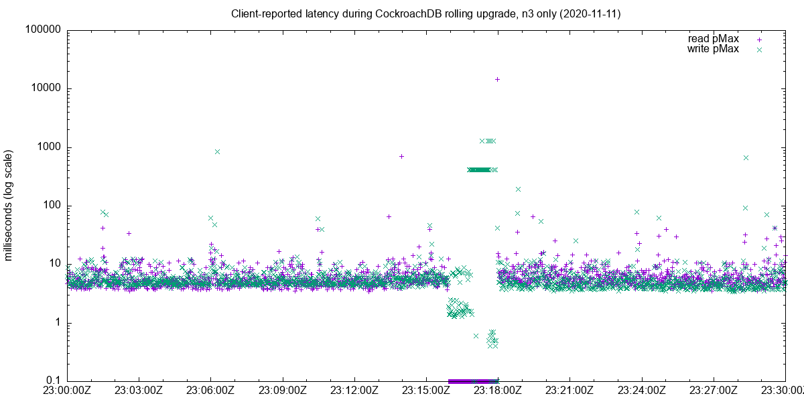

We observe:

* Performance is about the same before and after the upgrade.
* From the period when graceful shutdown begins until the node is back online, reads always complete immediately (presumably with an error).
* For n2 and n3, during the first half of the downtime (while we're waiting for the node to shut down gracefully), writes are faster.  This might be a result of less work being done by this node.
* For all three nodes, there's a period of relatively high write latency towards the end of the upgrade.  (This is almost 1s.)
* On nodes n1 and n3, there were read and write outliers in the tens of _seconds_ during the upgrade window.

In terms of **errors**, the output format of `cockroach workload` requires more work to plot the client error rate over time.  However, it's pretty quick to say the following:

[cols="2,1,1,4",options="header"]
|===

|Client pointed at node
|First error
|Last error
|Note

|n1
|23:13:25Z
|23:13:53Z
|All either `EOF`, `server is not accepting clients`, or `connect: connection refused`.  This is consistent with the expectations and the upgrade timeline.

|n2
|23:19:26Z
|23:21:37Z
|All either `server is shutting down`, `server is not accepting clients`, or `connect: connection refused`.  This is consistent with the expectations and the upgrade timeline.

|n3
|23:15:54Z
|23:17:54Z
|All either `server is shutting down`, `server is not accepting clients`, or `connect: connection refused`.  This is consistent with the expectations and the upgrade timeline.

|===

== Backup and restore using `cockroach dump`

On 2020-11-11 we ran a `cockroach dump` backup with _no_ workload running   This was on the same cluster as the previous testing, except that it had been upgraded to an OSS build of v20.2.0 (rather than RC4).  This build also included our fix for the UI issue mentioned above.

Reminder about initial state:

* 3-node cluster in AWS using i3.2xlarge instance types (local NVME, 8 CPUs, 61 GiB of memory)
* local storage: 1769 GiB (for the CockroachDB pool, being used for both the database and the backup file).  Separate pool for root filesystem.
* No client workload going on at all
* 308 total replicas, 383 GiB (entire cluster).  381.6 GiB in 272 ranges in just the "kv" database.

We ran this with:

[source,text]
----
$ nohup /cockroachdb/bin/cockroach dump --url postgresql://root@192.168.1.52:26257/?sslmode=disable kv > cockroach-dump.out 2> cockroach-dump.err
----

This ran from 22:04:26Z to 22:37:49Z and produced 81 GiB of data.  This was significantly less than we might expect (127 GiB is 1/3 of 382 GiB).  See "New questions" below.  We sanity-checked the output: the output file contains the same number of records as `select count(*) from kv` reports.

On 2020-11-23 we restored from this backup file into a new database called `newkv` using:

[source,text]
----
cockroachdb@nvmedb1:~$ /cockroachdb/bin/cockroach sql --insecure --host 192.168.1.52 -e 'CREATE DATABASE newkv';
CREATE DATABASE

Time: 23ms

cockroachdb@nvmedb1:~$ cd /cockroachdb/backups/
cockroachdb@nvmedb1:/cockroachdb/backups$  /cockroachdb/bin/cockroach sql --insecure --host 192.168.1.52 --database newkv < cockroach-dump.out > restore.out 2>restore.err &
[1] 2903
----

This was quite slow -- it took 6 hours 9 minutes -- but it did produce a table with the expected number of records.  According to the web console, the resulting table used 124.9 GiB and 165 total ranges.  The system appeared to have plenty of CPU and I/O headroom during this time.  This process might run largely single-threaded.  See:

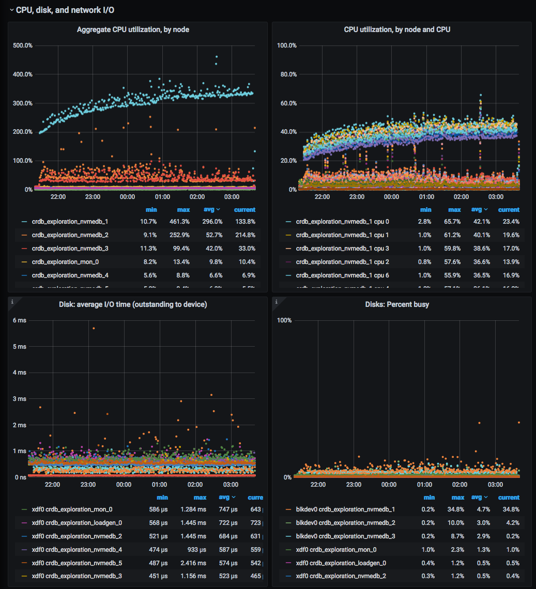
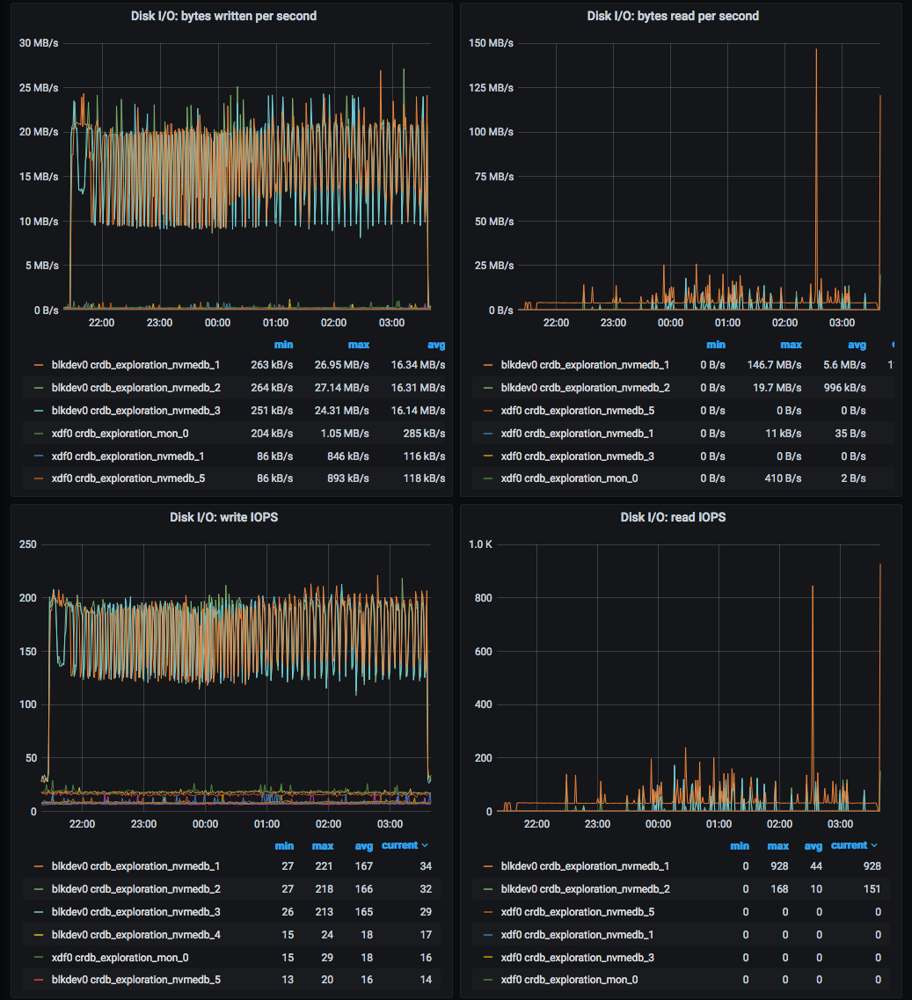
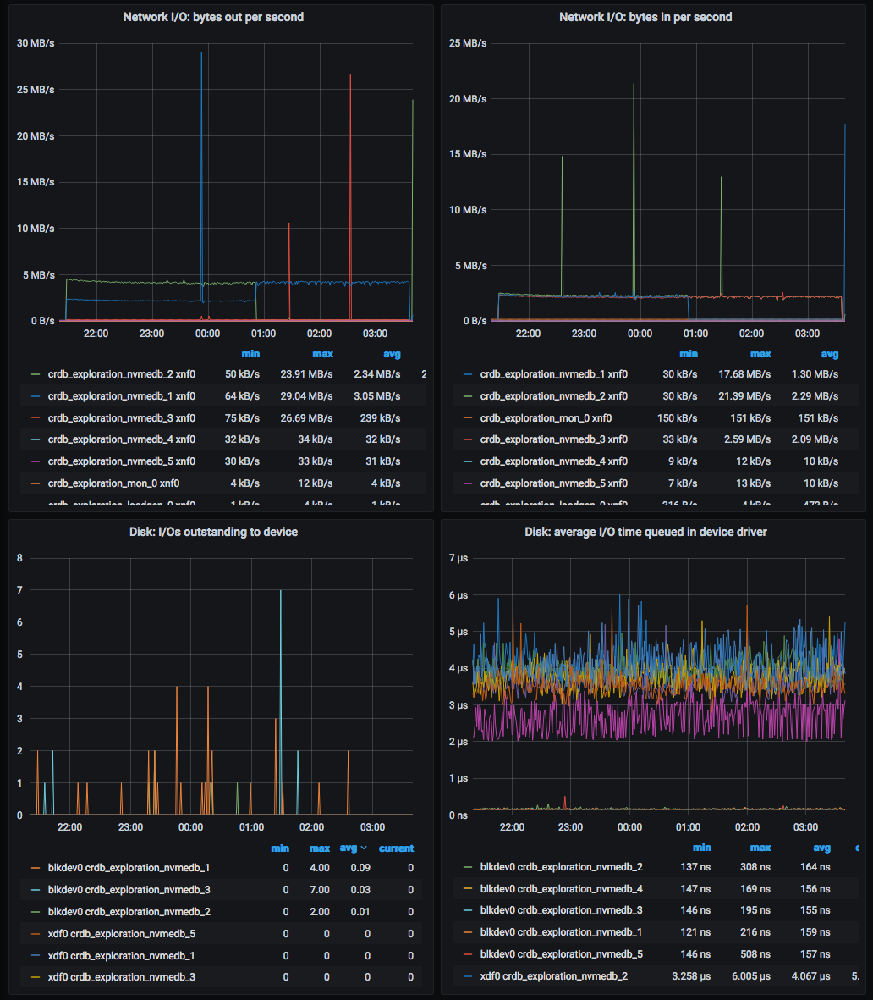
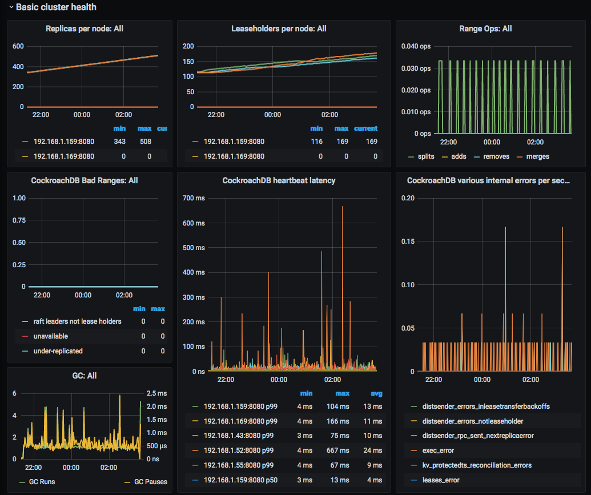

This data suggests only one node was being written to for extended periods, too.

== Online expansion and contraction

On 2020-11-18 we ran another round of expansion/contraction testing.  This is all with the same 3-node cluster using i3.2xlarge instances.  Reminder:

- database "kv": 381.2 GiB replicated size. 258 ranges.
- cluster: 3 nodes, 7.7% capacity used (disk space), idle for the last several days
- instances: i3.2xlarge (60 GiB memory, 8 VCPUs, 1700 GiB NVME SSD)
- OS: illumos omnios-r151034-b3d6e2addc
- CockroachDB: local OSS build of v20.2.0

We ran this workload (one `cockroach workload` instance for each of the three nodes in the cluster):

[source,text]
----
root@loadgen0:~/expansion# date="$(date +%FT%TZ)"
root@loadgen0:~/expansion# for node in 52 43 159; do
> nohup cockroach workload run kv --histograms kv-histograms-$node-$date.out --concurrency 4 --max-rate=333 --display-every=1s --read-percent 80 --tolerate-errors postgresql://root@192.168.1.$node:26257/kv?sslmode=disable > loadgen-summary-$node-$date.out 2>&1 &
> done
[1] 26884
[2] 26885
[3] 26886
----

We also instrumented every fsync on all nodes in the cluster, including the two we hadn't brought up yet:

[source,text]
----
# dtrace -q -n 'syscall::f*sync:entry{ self->start = timestamp; } syscall::f*sync:return/self->start/{ printf("%Y.%09u %-8s %7d us\n", walltimestamp, walltimestamp % 1000000000, probefunc, (timestamp - self->start) / 1000); self->start = 0; }' | tee /cockroachdb/fsync_times.out
----

Note that we only started this shortly _after_ the first cluster expansion, so it covers much of the time of this whole experiment (including one full expansion, most of another expansion, and two contraction operations) but not all of it.

Here's a timeline of events for this testing:

[source,text]
----
2020-11-18T22:23:39Z start client workload
2020-11-18T22:45:04Z start node 4
2020-11-18T23:53:00Z range movement completed
2020-11-19T00:03:20Z start node 5
2020-11-19T00:56:00Z range movement completed
2020-11-19T02:18:00Z decommission node 5 started
2020-11-19T02:39:57Z decommission node 5 completed
2020-11-19T02:56:44Z decommission node 4 started
2020-11-19T03:30:56Z decommission node 4 completed
----

Here's the client-side latency and throughput during this testing (using per-second data):

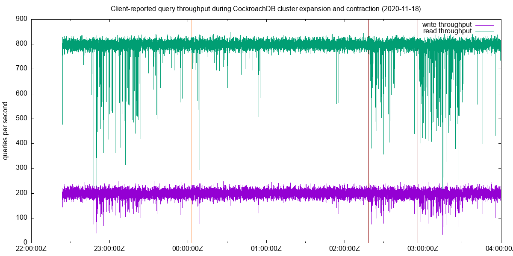
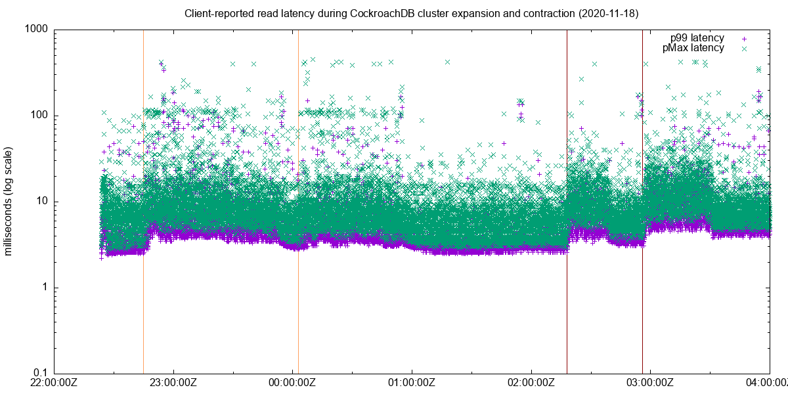
image::nvme-11-scale-client-latency-writes.png[]

Clients reported 0 errors for the duration of the test.

Here's what it looks like on the server (remember, these rates are 40-second averages):

image::nvme-11-scale-server-overview.png[]

Here's the resource utilization during this period:

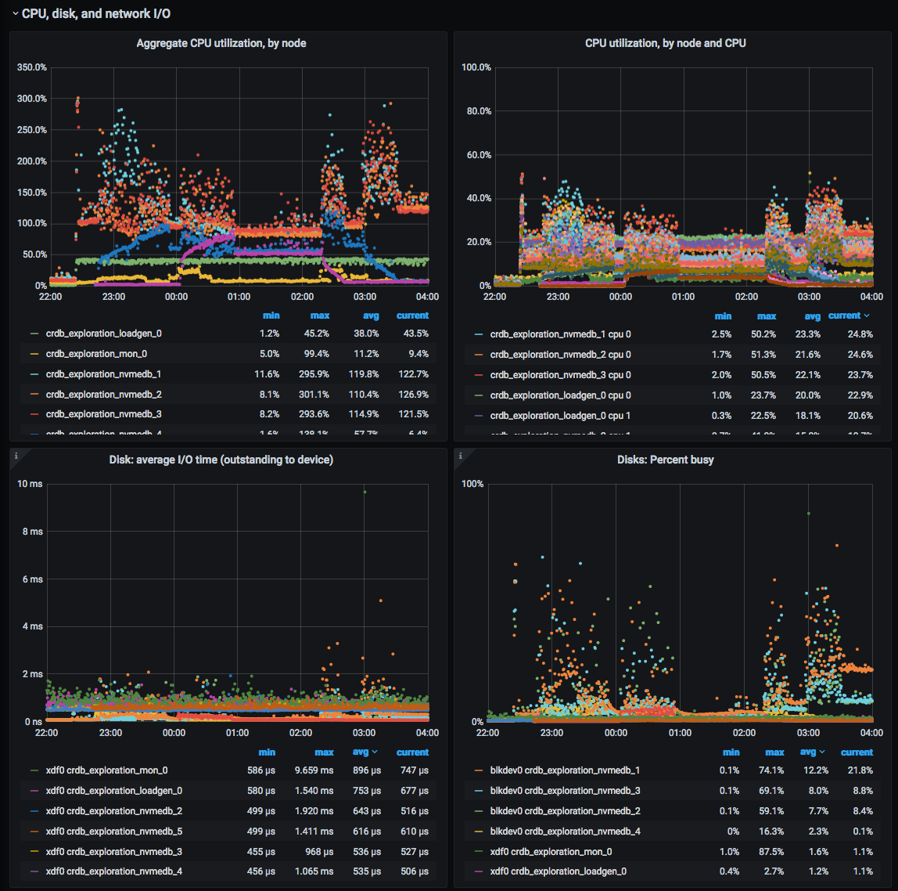

and here are key CockroachDB metrics:

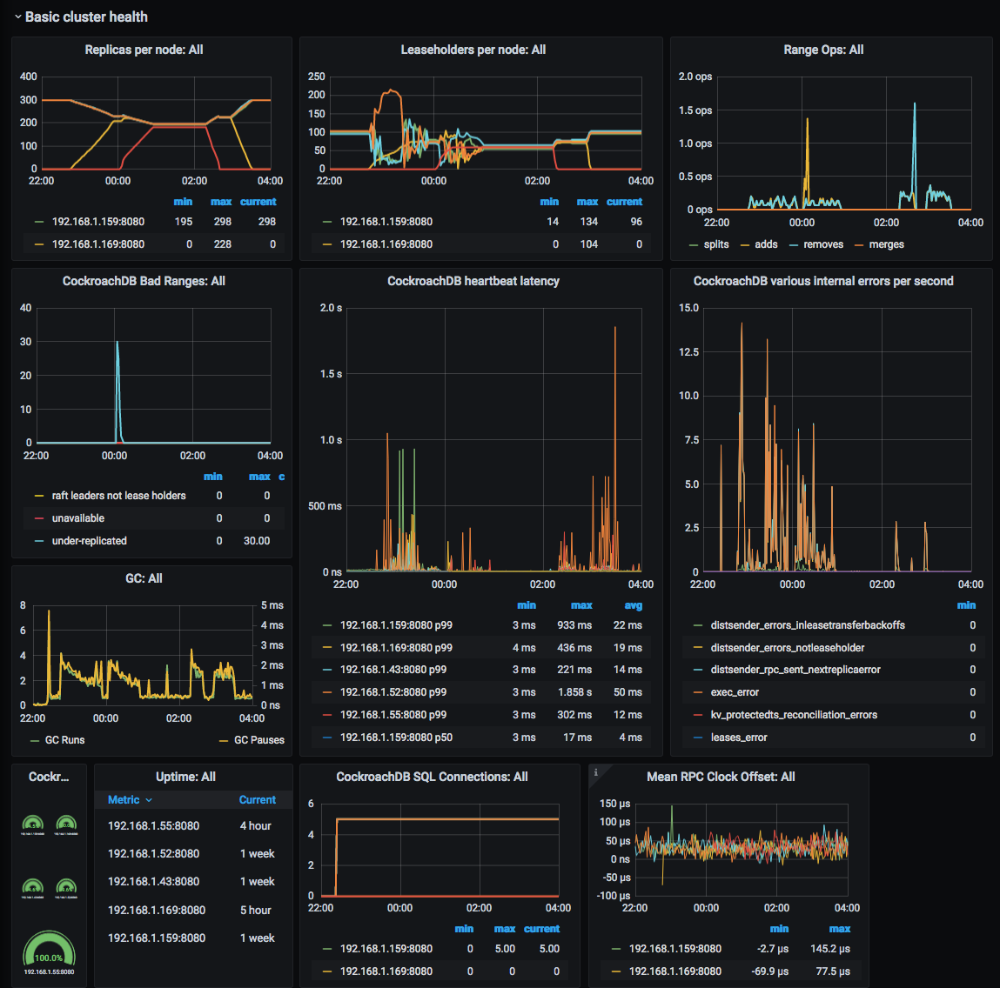

As for ZFS fsync latency, since we traced the latency of every fsync, we can compute precise stats:

[cols="2",options="header"]
|===
| Stat
| ZFS fsync latency

| Average
| 416 us

| Median
| 329 us

| p95
| 542 us

| p99
| 1598 us

|===

Key takeaways:

* The impact to tail latency remains significant -- at least 2x -- but better than in previous testing, where we may have been resource-constrained to begin with.
* The impact to throughput is significantly _less_ than before.  We expect this is largely because we configured the workload level to be lighter than before.  It has some slack in it: the clients are targeting a particular rate that's less than what the system is capable of in normal conditions.
* The time required to finish moving replicas around was notably longer than in previous testing (almost an hour for the expansions), but this is not a problem.
* ZFS fsync latency is generally within our expectations.

== Schema change, part 1

On 2020-11-20 we exercised some basic schema changes using the same cluster, database, and workload we've been using for all this testing.  Reminder: this is a 3-node cluster on AWS i3.2xlarge instances.  The database was built using the "kv" workload.  _After_ this testing the system reports that the "kv" database is 241 GiB and 417 total ranges, which is significantly less data and more ranges than on 2020-11-18.  It's not clear why.  Total "live bytes" for the whole cluster has only ranged from 126 GiB to 128 GiB since 2020-11-11.

Again, we ran this workload (one `cockroach workload` instance for each of the three nodes in the cluster):

[source,text]
----
date="$(date +%FT%TZ)"
for node in 52 43 159; do
	nohup cockroach workload run kv --histograms kv-histograms-$node-$date.out --concurrency 4 --max-rate=333 --display-every=1s --read-percent 80 --tolerate-errors postgresql://root@192.168.1.$node:26257/kv?sslmode=disable > loadgen-summary-$node-$date.out 2>&1 &
done
----

The original table schema looks like this:

[source,text]
----
root@192.168.1.163:26257/kv> \d kv;
  column_name | data_type | is_nullable | column_default | generation_expression |  indices  | is_hidden
--------------+-----------+-------------+----------------+-----------------------+-----------+------------
  k           | INT8      |    false    | NULL           |                       | {primary} |   false
  v           | BYTES     |    false    | NULL           |                       | {}        |   false
(2 rows)
----

Here's a timeline of the schema changes that we ran:

[source,text]
----
CREATED              FINISHED             ELAPSED   SQL
2020-11-20T19:56:09Z 2020-11-20T19:56:12Z        3s ALTER TABLE kv.public.kv ADD COLUMN d1 INT8 DEFAULT NULL
2020-11-20T19:58:22Z 2020-11-20T21:04:02Z  1h05m40s ALTER TABLE kv.public.kv ADD COLUMN d2 INT8 NOT NULL DEFAULT 3
2020-11-20T22:03:05Z 2020-11-20T22:03:05Z        0s ALTER TABLE kv.public.kv RENAME COLUMN d2 TO d3
2020-11-20T22:04:12Z 2020-11-20T23:03:09Z    58m57s ALTER TABLE kv.public.kv DROP COLUMN d1
2020-11-20T23:26:42Z 2020-11-21T00:57:49Z  1h31m07s ALTER TABLE kv.public.kv DROP COLUMN d3
----

Here are graphs of throughput, read latency, and write latency during this period, with the long-running schema change jobs highlighted:

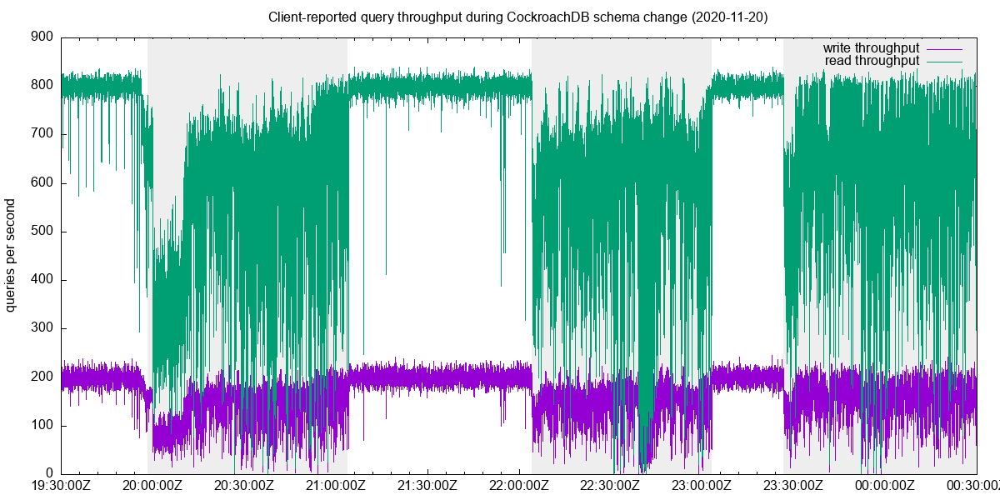
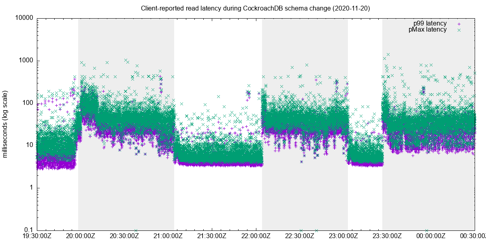
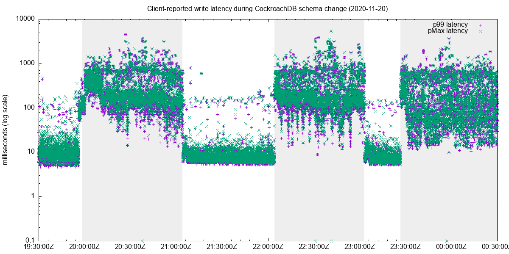

Clients reported 0 errors for the duration of the test, but the performance impact was quite significant.  Note that while the schema change was _not_ running, there was plenty of CPU and disk I/O headroom on the system, but it was used up during the schema change job:

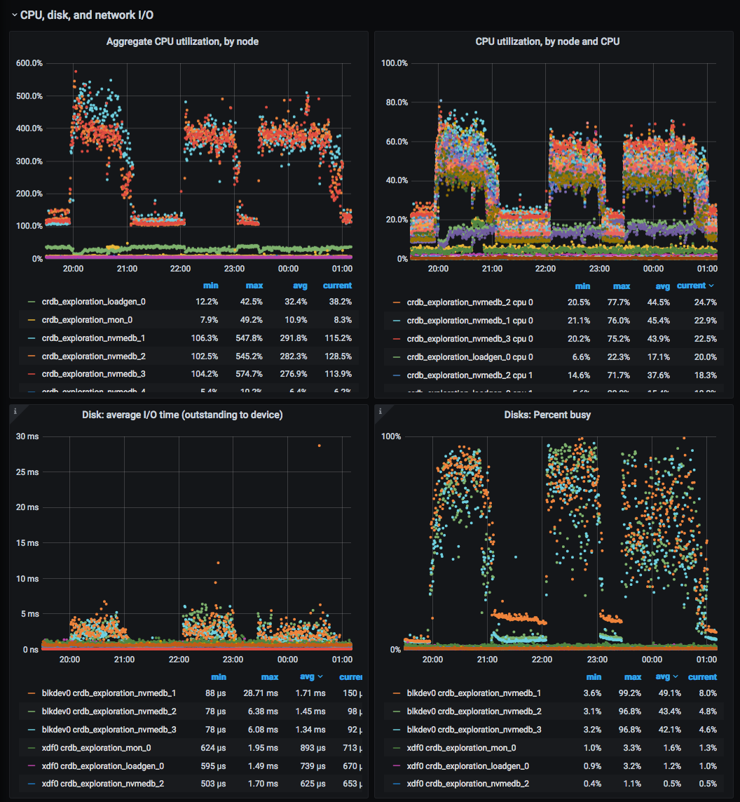

NOTE: We also see significant increase in the time that I/Os were outstanding to the NVME device during this period.  Tracing showed most of these disk I/Os were 128 KiB and 1 MiB, so it's expected that these might take longer.  This suggests a slog device for this pool might be advantageous as a way to separate the fast synchronous I/Os from the large, bulk I/Os.

Overall, this operation had a lot more impact than expected: **while CockroachDB is rewriting data, p99 is 10x worse and throughput is significantly reduced**.  That's even though clients are idle a fair fraction of the time.

What about the two "quick" schema changes, which took only a few seconds and did not require rewriting any data?  The first one did have a sizable impact on write latency that lasted after it was completed.  This did add a second column, so it makes sense that write latency might increase, although it appears to be close to 10x:

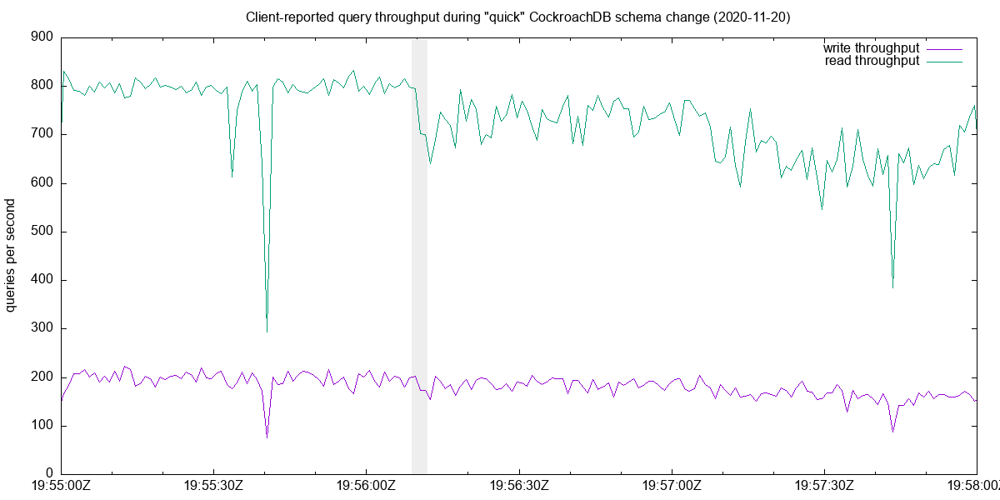
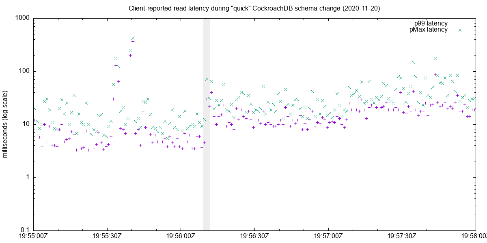
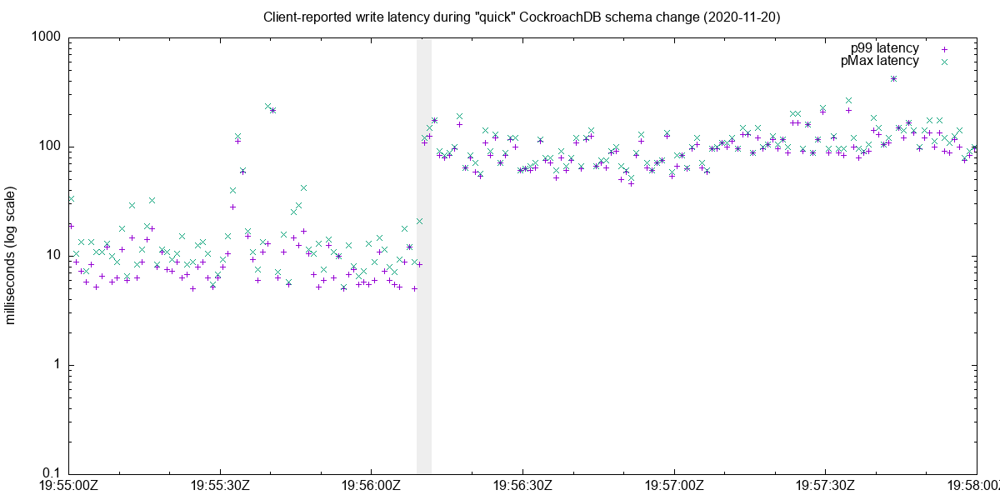

The second "quick" schema change was just a column rename and had no visible impact:

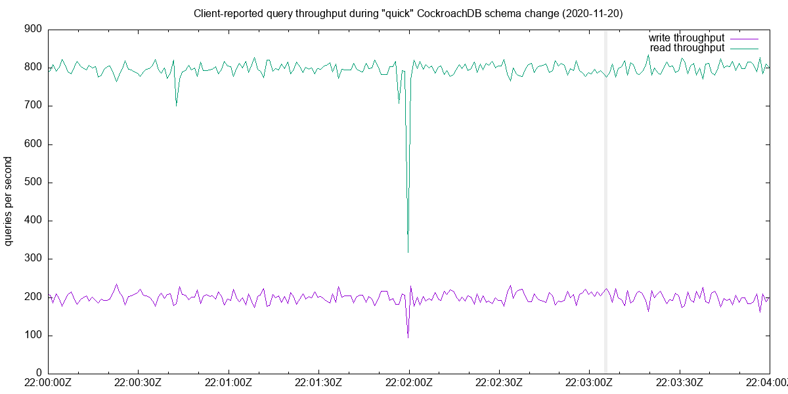
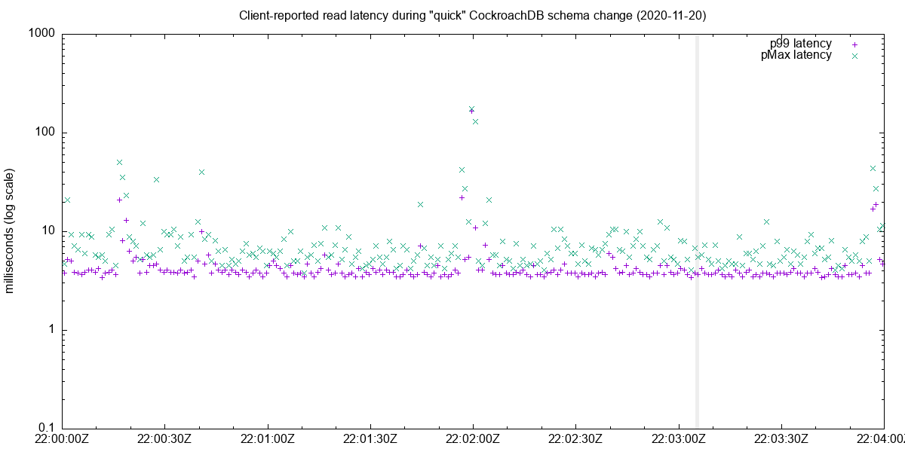
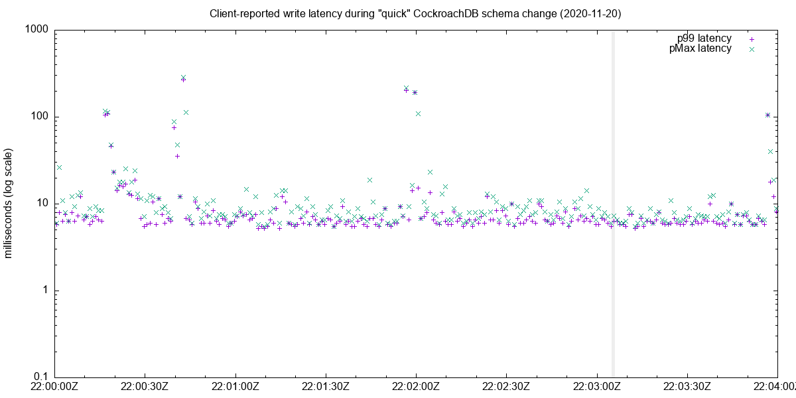

That's good.  An operation like this in PostgreSQL might still take an exclusive lock on the table, if briefly, resulting in a latency bubble.

Overall, though, this is quite a significant impact, even though the cluster had significant headroom before doing the schema change.

== Schema change, part 2

On 2020-11-24, we attempted to reproduce the results from the previous schema change experiment ("part 1" above) using i3.4xlarge instances.  We set up a cluster of 3 nodes on i3.4xlarge (16 VCPUs, 122 GiB memory).  Then we restored the `cockroach dump` database backup we had above to populate the database.  The difference was that we set up this ZFS pool with a separate log device (slog) using a (second) local NVME device.

We ran a first test in which we ran the same (light) workload as above:

[source,text]
----
date="$(date +%FT%TZ)"
for node in 192 237 141; do
	nohup cockroach workload run kv --histograms kv-histograms-$node-$date.out --concurrency 4 --max-rate=333 --display-every=1s --read-percent 80 --tolerate-errors postgresql://root@192.168.1.$node:26257/kv?sslmode=disable > loadgen-summary-$node-$date.out 2>&1 &
done
----

Then I ran an `ALTER TABLE` that took 33 minutes and did a bunch of I/O.  This is a fair bit faster than on the other cluster.  The impact was quite bad at first, but got a lot better.  While this was running, we disabled the slog on one box, but it appeared to make no difference.  We don't have client-side data from this test.

Now, we had doubled the memory and VCPUs on these machines, so we decided to ramp up the workload too, using this:

[source,text]
----
date="$(date +%FT%TZ)"; for node in 192 237 141; do nohup cockroach workload run kv --histograms kv-histograms-$node-$date.out --concurrency 8 --max-rate=667 --display-every=1s --read-percent 80 --tolerate-errors postgresql://root@192.168.1.$node:26257/kv?sslmode=disable > loadgen-summary-$node-$date.out 2>&1 & done
----

We doubled the concurrency and the target operation rate from each load generator.  We started with the slog devices _disabled_ on all three nodes at this point, just looking to reproduce the pathological behavior from the last time we did this testing.  We ran another expensive `ALTER TABLE`, this one starting around 18:03Z.  We let this run for a while, then enabled the slogs around 18:31Z on all three systems.  The `ALTER TABLE` finished around 18:40Z.  Here's the data on throughput, latency, and resource utilization during this period:

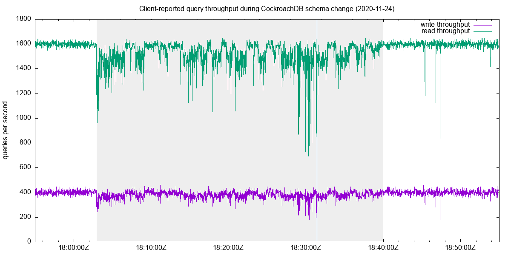
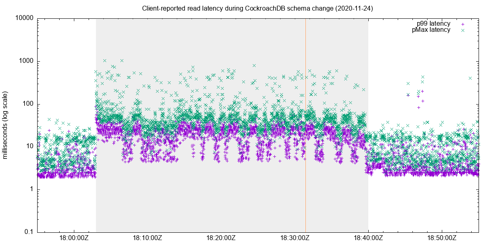
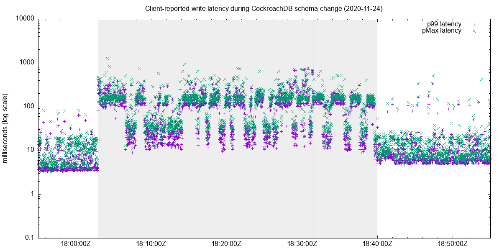
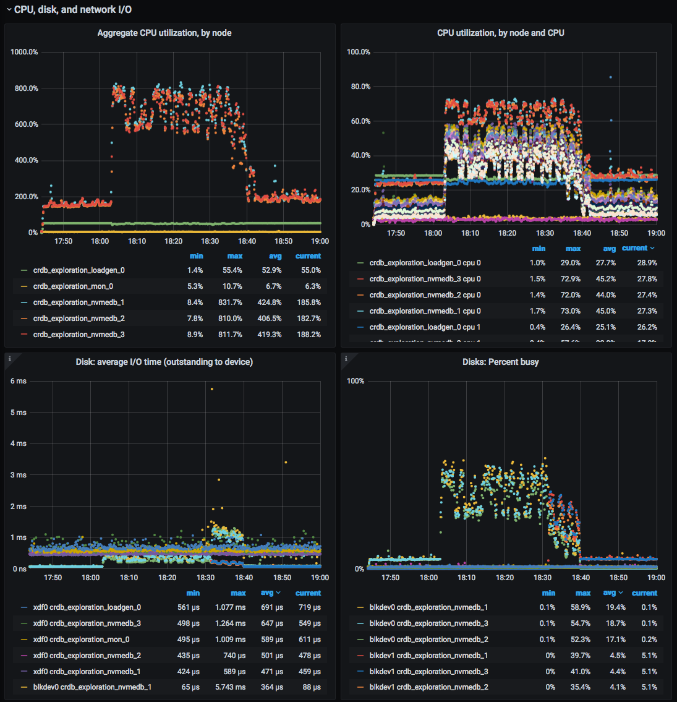

The slog online at 18:31 made no observable impact in latency or throughput, but critically: we _never_ saw the pathological behavior that we saw last time we did this testing.  The client latency was not so badly degraded, nor was average I/O latency nearly so high.  The behavior may be different because this is different hardware (which we don't have insight into, since this is AWS), because they're larger instance types, or because of the different ways the databases were created (this was a restore, while the last round resulted from running the workload for an extended period).

The result with respect to the slog seems inconclusive.  It's perhaps a good sign that we were able to complete this schema change without a major impact, which implies that it's at least possible under some conditions.

== New questions

* Why would the `cockroach dump` backup file be smaller than the database itself if it contains all of the data in the database?
* Relatedly, we've found that when we expand the cluster and then contract it to the same size as it was originally, the disk space used is reduced, though in some cases the range count has gone up significantly.  Why might this happen?
* Is there a way for us to observe how much data is ready to be GC'd but hasn't been cleaned up because the ttlperiod hasn't expired yet?
* Are there any controls available to limit the resources used for background operations like schema changes?  We found a number of GitHub issues around this, with a lot of activity in the early 2019 timeframe, but activity on most of them has dropped off.  Examples: https://github.com/cockroachdb/cockroach/issues/36430[36430], https://github.com/cockroachdb/cockroach/issues/47215[47215], https://github.com/cockroachdb/cockroach/issues/34868[36850], https://github.com/cockroachdb/cockroach/issues/34868[34868].
