// Include a Table of Contents on the left hand side.
:toc: left
// ":icons: font" is needed for admonition and callout icons.
:icons: font

= CockroachDB testing summary

The Oxide system's control plane requires a low-touch, highly-available, horizontally-scalable, strongly-consistent data store (see <<rfd48>>) for storing a variety of data including user configuration, hardware inventory, and runtime state.  The specific requirements around scale, performance, and functional and non-functional requirements are discussed in <<rfd53>>.  A number of modern database systems (generally grouped under the term "NewSQL") seek to meet these requirements.  This document describes our initial experiences with CockroachDB.

We've tried to organize this document to be most efficient for readers.  It's most important to read through the <<_goals>> and <<_executive_summary_of_results>> sections.  Readers wanting to better understand our decision-making or CockroachDB probably want to read through <<_why_cockroachdb,why we focused on CockroachDB>> and some <<_cockroachdb_basics,basic concepts>> for evaluating CockroachDB and our test results, plus the summary of tests, caveats, and areas of technical risk.  The rest of the document contains lots more detail about the tests, which we don't expect most people to pore through (though that would be welcome).  It might be useful for sanity-checking.

== Goals

Our primary goal here is to select a technology to use as a database for the control plane.  Naturally, we'd like to select an existing system that meets our requirements rather than build one from scratch.  The underlying technical problems are quite complex.  Even if the best candidate falls short, we may still be better off adapting it (and potentially our usage of it) rather than starting from scratch.

Secondarily, we want to uncover particular areas of focus for future testing and development to mitigate major problems found with whatever technology we choose.

Importantly, our goal here is _not_ to completely de-risk the choice of database, but to gain enough confidence to justify moving forward with it.

There is little here about absolute performance, as our specific requirements in this domain are not particularly hard.  (See <<rfd53>>.)

== "Executive" summary of results

(probably not brief enough to be called "executive")

We started as described in <<rfd53>> by surveying popular technologies, primarily CockroachDB, Yugabyte, and TiKV/TiDB.  Based on documentation and user experience reports, we chose CockroachDB as the most promising candidate for more serious testing.  See <<NewSQL-notes>> for raw notes from this initial survey, and see <<_why_cockroachdb>> below for why we started with CockroachDB. 

We tested basic operation, online expansion and contraction, and several fault scenarios.  Through all this, we found lots to like about CockroachDB.  Some of these might seem like low bars (e.g., no data loss), but they're nevertheless critical and so worth mentioning:

* We did not observe any data loss.
* We did not observe inconsistency (in the CAP sense), though we were not testing for this directly.
* We did not observe any unexpected crashes.  There's one category of issue where CockroachDB crashes by design (loss of clock synchronization) that we expect can be managed.
* CockroachDB never required operator intervention to re-establish availability after failures.  Nodes quickly and reliably rejoined the cluster and began serving traffic.
* Despite our inducing various failures both transient and extended, the cluster always converged to a state of sufficient replication (as measured by its own metrics) without operator intervention.
* The documentation has generally been good: it adequately describes the system's setup and operation.  We did have some <<_open_technical_questions, open questions>> not answered by the docs.
* Tooling has generally been good.  There are built-in tools for managing the cluster (e.g., decommissioning nodes), running a variety of workloads, etc.  The built-in web Admin UI gives good overall situational awareness.
* The system provides good coverage of metrics about its operation, plus other observability tools (e.g., query analysis, distribution of data across nodes, various reports about problem nodes or ranges, etc.).  Many of these are fairly unpolished (e.g., the report about hot ranges is just a JSON endpoint).
* We tested some basic reconfiguration like adjusting the GC period, and that worked as expected.

There's also some disappointment:

* In a lot of cases, both expansion and contraction of the cluster resulted in brief periods (2-3 minutes) where almost no requests completed at all and longer periods (20-30 minutes) where average and p95 latency were significantly increased (2x-3x).  Some of these tests were on systems that were under-powered in terms of IOPS, and things were better on systems with more IOPS available, but it still wasn't great.
* There can be considerable variance in performance (10% to 100%) depending on which node receives a particular query.  This is particularly true for workloads with a working set in memory.  Since the cluster automatically splits ranges, merges ranges, and moves leaseholders around, performance can be inconsistent over time even for a uniform workload.  This automatic adaptation is probably good overall, but capacity planning and SLO management could be more difficult as a result.
* In the few cases we wanted them, there didn't seem to be a lot of operational controls.  For example, we observed one node being particularly hot.  It did not seem that there was a way to tell CockroachDB to move some of its leases to other nodes.  (CockroachDB does try to be completely hands-off, and a fair objection to such a control is that if the system is managing leases, it may well decide to move those leases back right after the operator moves them.  Really, you don't _want_ to have to manually configure this.)
* The primary risk identified from user experience reports is that the built-in (non-Enterprise) backup/restore option is not suitable for many production clusters.  We did not dig into this and it's probably one of the biggest open risks.
* Most of the technical content that we found on the web comes directly from CockroachDB.  It's great that they have so much useful documentation, but is it worrisome that there _isn't_ more from a large, active user base?  Would we be too dependent on the company?  (It's not clear any of the other NewSQL systems are any better in this regard.)

Again, there are lots of functionality, fault conditions, and stress scenarios that we did not test.

IMPORTANT: **Our conclusion is that CockroachDB is solid enough to continue moving forward with and it's not worth spending comparable time right now evaluating other options.**

IMPORTANT: **For readers:** are there any results here that we should be more concerned about than reflected here?  Are there other tests we should run now before proceeding with CockroachDB?

== Why CockroachDB

Why did we start with CockroachDB over the other NewSQL options?  Most of the NewSQL family of databases have similar properties:

* architecturally based on Google's Spanner
* SQL-like interface
* strong consistency (in the CAP sense)
* horizontal scalability, including expansion without downtime
* reasonably tight dependency on synchronized clocks
* support mutual authentication of both clients and other server nodes using TLS

**It seems fairly likely that any of the big options would work for us.  It also seems reasonably likely that any one of them might have some major issue that we won't discover until we're pretty far down the path of using it.**

For us, the most appealing, differentiated things about CockroachDB are:

* It has a https://www.cockroachlabs.com/docs/v20.1/architecture/overview.html#goals-of-cockroachdb[strong focus on hands-off operation].  Initial setup is a good example of this.  There's only one component to deploy, and you just need to point it at enough other instances to find the cluster.  By contrast, with TiDB, there are several components to deploy, which means independently monitoring their availability and utilization and independently scaling them out.  The https://docs.pingcap.com/tidb/dev/production-deployment-using-tiup[documented options] for TiDB deployment include Kubernetes, Ansible, and https://docs.pingcap.com/tidb/stable/tiup-overview[TiUP], the last of which appears to be a full-fledged package manager _and_ cluster management tool.
* It has a very strong <<CockroachDB-Jepsen-Report>>.  The Jepsen report for CockroachDB was glowing.  The reports for https://jepsen.io/analyses/yugabyte-db-1.3.1[Yugabyte] and https://jepsen.io/analyses/tidb-2.1.7[TiDB] showed some serious issues, including several operational issues.  It's important to remember that these reports are about a year old and the serious issues have likely been addressed.  Relatedly, Yugabyte's public blog post claimed (and as of September 2020 still claims) to have passed Jepsen, a claim so misleading that the Jepsen report added a note at the top saying that's not true.
* It's range-sharded, meaning that keys are sorted rather than hashed.  This is critical for enabling pagination in large collections.  https://www.cockroachlabs.com/blog/unpacking-competitive-benchmarks/[CockroachDB discusses this and other issues in a blog post] (obviously very biased by the source, but the technical details appear accurate).  By contrast, Yugabyte is primarily hash-sharded.  (Yugabyte supports range sharding but our notes show that as of May it appeared to lack active rebalancing for them.  This functionality https://docs.yugabyte.com/latest/architecture/docdb-sharding/tablet-splitting/#automatic-tablet-splitting-beta[appears to be supported in beta] now.)

Yugabyte is completely open-source (as opposed to CockroachDB, which is under the Business Source License).  It also https://blog.yugabyte.com/why-we-built-yugabytedb-by-reusing-the-postgresql-query-layer/[directly uses the PostgreSQL query execution engine, so it supports more PostgreSQL functionality out-of-the-box].  In the above-linked post, CockroachDB claims this makes it harder for Yugabyte to distribute query execution, but we did not dig into this claim.

TiDB is also open-source and the company, PingCap, has https://pingcap.com/blog/tag/Rust[written a lot about their use of Rust] (although only parts of TiDB are in Rust).  https://docs.pingcap.com/tidb/stable/mysql-compatibility[TiDB emphasizes MySQL compatibility] rather than PostgreSQL.

== CockroachDB basics

It's important to understand some fundamentals about CockroachDB just to know how to test it, let alone evaluate it in detail.

=== Architecture

CockroachDB exposes a SQL interface using the PostgreSQL wire protocol and consumers https://www.cockroachlabs.com/docs/stable/install-client-drivers.html[typically use a regular PostgreSQL client].  SQL queries are served by whatever node the client sends the request to, which is called the **gateway node**.  The expectation is that clients load-balance requests across nodes in the cluster or that the cluster is deployed behind a load balancer like haproxy or EBS. 

Internally, https://www.cockroachlabs.com/docs/stable/architecture/distribution-layer.html#overview[all data is kept in a key-value store].  The entire key space is sorted and divided into **Ranges**, primarily based on size (512 MiB by default).  Each Range has some number of **Replicas** corresponding to the configured **replication factor**.  Ranges are split based on size and https://www.cockroachlabs.com/docs/v20.1/load-based-splitting.html[load].  They can also be https://www.cockroachlabs.com/docs/v20.1/range-merges.html[merged based on size].

For **writes,** there's a separate instance of the Raft consensus algorithm for each Range, based on the nodes that hold Replicas for that Range.  Writes are directed to the Raft leader for the Range and write requests always run through Raft consensus algorithm to ensure strong consistency.

**Reads** do _not_ go through Raft: instead, there's a **leaseholder** for the Range.  This is one of the nodes with a Replica for this Range, and it's almost always the same node as the Raft leader.  All reads for a Range are directed to the leaseholder, which can generally serve the request from its own copy.  In cases where strong consistency might be violated, reads are sometimes delayed.

To summarize: the gateway node turns the request into key-value operations that are distributed to other nodes: the Raft leader (for writes) or leaseholder (for reads) for the Range associated with each key.  For more, see https://www.cockroachlabs.com/docs/v20.1/architecture/reads-and-writes-overview.html[Reads and Writes in CockroachDB] and https://www.cockroachlabs.com/docs/v20.1/architecture/life-of-a-distributed-transaction.html#overview["Life of a Distributed Transaction"].

=== Fault tolerance

Transient failures of individual nodes do not significantly affect reads or writes.  Based on the basics above, we'd expect that:

* For any Range where the failed node is not the Raft leader, writes would be largely unaffected, since the Raft cluster can quickly achieve consensus with the remaining nodes.
* For any Range where the failed node is not the leaseholder, reads would be unaffected, since only the leaseholder is used for reads.
* For a Range where the failed node is the Raft leader or leaseholder, write or read requests would be unavailable (respectively).  However, no data needs to be moved for the leader or leaseholder to be moved to one of the other Replicas.  (Again, we're talking about transient failures.)

CockroachDB declares a node dead if it https://www.cockroachlabs.com/docs/v20.1/cluster-setup-troubleshooting.html#node-liveness-issues[hasn't heartbeated to the cluster] for https://www.cockroachlabs.com/docs/v20.1/demo-fault-tolerance-and-recovery.html#step-5-simulate-a-single-node-failure[5 minutes].  When that happens, the Ranges that had Replicas on that node will be declared _under-replicated_.  The cluster picks new nodes to host replacement Replicas, and data is copied from the nodes that are still available.  This can have a notable performance impact while data is flying around.

=== Surviving multiple failures

It's critical to understand that **the number of nodes in the cluster is not the same as the replication factor**.  Suppose you have a cluster of 7 nodes configured with replication factor 3 (the default).  With 7 nodes, you might think that you could maintain availability even while losing two nodes.  That's wrong: consider the Ranges that have Replicas on both of those nodes.  (With enough Ranges in the system, it's likely that _some_ will have a replica on each of the two failed nodes.)  Those Ranges only have one Replica available, which is not enough for consensus.  Such Ranges will be unavailable.

It's important to remember that the replication factor determines how many failures you can survive.  Adding cluster nodes alone only increases capacity (in terms of storage and performance), not availability.

=== Client behavior and retries

As mentioned above, CockroachDB uses the PostgreSQL wire protocol so that you can use a standard PostgreSQL client.  Cockroach Labs provides https://www.cockroachlabs.com/docs/v20.1/third-party-database-tools["beta" level support for rust-postgres] and the team appears to have https://github.com/sfackler/rust-postgres/issues/171#issuecomment-218832633[contributed improvements to that crate].

Under some conditions, in order to maintain strong consistency when multiple transactions modify the same data, CockroachDB aborts a transaction with a retryable error.  In many cases, CockroachDB automatically retries the transaction.  In the rest of cases, it's up to the client to do so when it receives the appropriate error code.  According to the docs, some client libraries automatically handle these cases, and even if not, it's fairly straightforward: you just issue a `ROLLBACK` and try again.  For more, see the https://www.cockroachlabs.com/docs/v20.1/transactions#transaction-retries[documentation on transaction retries].  Server-side retries are automatic as long as the statements are issued to CockroachDB as a batch and the results are small enough that they're buffered rather than streamed.  These conditions are under the client's control.

=== Automatic background activities

CockroachDB automatically does a few things that have potentially significant impact on performance:

* https://www.cockroachlabs.com/docs/v20.1/frequently-asked-questions.html#how-does-cockroachdb-scale[splits ranges based on size]
* https://www.cockroachlabs.com/docs/v20.1/load-based-splitting.html[splits ranges based on load]
* https://www.cockroachlabs.com/docs/v20.1/range-merges.html[merges ranges based on size]
* https://www.cockroachlabs.com/docs/v20.1/architecture/replication-layer#load-based-replica-rebalancing[moves replicas based on load]
* (unverified) moves leases to other replicas?
* (unverified) moves replicas based on available capacity?

These can dramatically impact performance.  In particular, load-based splitting can split a busy Range into two less-busy Ranges.  If a different node becomes the new Range's leaseholder, then the original busy load can be successfully split across two nodes.

=== Implications for testing

CockroachDB's assumption that clients will distribute load evenly to available cluster nodes (which is generally a fine approach) complicates our testing.  If fault testing includes a load balancer, it would be easy to end up testing the behavior of that load balancer and not the cluster itself.  If we leave out the load balancer, then each client is directed at a particular cluster node, and that client will see failures whenever that node is offline.  We need to discount those failures if we're only trying to assess the cluster's behavior.  (In principle, we do care about the load balancer and client-side behavior as they relates to availability, but in practice, we have good reason to believe we can build this ourselves as long as the server behaves reasonably.  So we want to test the server's behavior now rather than build a perfect client first.)

Performance testing is affected by the way requests are distributed from gateway nodes.  Consider a 3-node cluster where clients are distributing requests evenly to all three nodes, but where the workload is concentrated on one Range.  In this case, we'd expect the Raft leader and leaseholder for the active Range to have notably lower latency (by at least one internal network round-trip) and higher throughput -- and this is what we observed.

When the cluster decides to split Ranges or move leaseholders, overall latency and throughput can suddenly change significantly, even though nothing is wrong.  If that happens during fault testing, care must be taken not to assume that the fault caused the change in performance.  We'd expect this effect to be small when the number of Ranges is high enough that any one split or leaseholder move is a small fraction of the overall load.

== Summary of the tests

**Online expansion**: while pointing one load generator at each node in a 3-node cluster, increase the cluster gradually to 6 nodes and observe latency, throughput, and error rate.  We were not looking for improved latency or throughput -- that winds up being complicated by various other factors and we decided that was better for a separate horizontal scalability test -- but just to know that latency and error rate were not significantly impacted.  Unfortunately, in most cases, the cluster did stop serving requests for a few minutes and then performed poorly for the next 20-30 minutes while data was moved around.

**Online contraction**: similar to online expansion, with similar results.  In this case, we started with one load generator for the first three nodes in a 6-node cluster.  Then we gradually decommissioned nodes and observed the latency, throughput, and error rate.  The results were similar to expansion.

**Long-running workload**: we ran one workload for 240 hours (over 9 days) to look for any major degradation.  Overall, this went well, though there were occasional brief spikes in latency and comparable degradation in throughput.

We also ran several kinds of **fault testing**:

* **`kill -9`** instances of CockroachDB.  This had virtually no affect on the cluster.  The killed node was serving requests again in single-digit seconds.  Only in-flight requests seemed to be affected.
* **Reboot the OS** on the system hosting one node.  This had virtually no affect on the cluster.  This node was back up and serving requests within 90 seconds, nearly all of that being OS reboot time.  Only in-flight requests seemed to be affected.
* Initiate an **OS panic** on the system hosting one node.  (This is similar to a reboot, but behaves more like a network partition, since TCP connections are not gracefully torn down.)  This looked nearly the same as an OS reboot except that it took a little longer for the OS to come back up.
* **Transient single-node partition**: use firewall rules to introduce a partition around a cluster node for less than the default 5-minute timeout for declaring a node "dead".  There were some oddities around the client-side reporting (see <<_open_technical_questions>>), but the overall impact was good.  There were no errors, and while latency rose, it was less than ambient fluctuations for the previous 30 minutes.  Queries per second dropped across the cluster and throughput on all nodes went down.  All nodes' CPU usage and disk throughput when down.  This is probably because one load generator was off, not because one node was down.
* **Long single-node partition**: use firewall rules to introduce a partition around a cluster node for longer than the default 5-minute timeout.  We saw similar oddities around client-side latency, but the overall impact was good.  There were some multi-second latency outliers on a bunch of nodes but they were mostly beyond p99.

See <<_details_on_tests_run>> for more details.

== Caveats and limitations on these results

We wound up doing a lot of _ad hoc_ testing (sometimes in response to unexpected issues with a given test).  While we tried to control variables, it's possible that some results are path-dependent.  For example, our long-running workload test was run on the same cluster that had been expanded and contracted again at least once, and it's possible it would have different performance characteristics than one that had not gone through that process.  Relatedly, although we were reasonably careful with data collection, a more fully-automated process that also collected data regularly from the load generators would reduce the possibility of problems we missed.

We did not end up directly verifying horizontal scalability (that is, in a controlled test).  We saw it in practice during expansion and contraction activities, but we didn't scale up or down the workload to really prove it.

We used a pretty limited number of workloads: primarily the "kv" (key-value) workload that ships with the https://www.cockroachlabs.com/docs/stable/cockroach-workload.html[`cockroach workload`] tool.  This was sufficient to exercise reads and writes, with some control over the size of writes and the fraction of read requests.  We also used the same tool to populate our large databases.  Results could be very different for data that looks very different, as might happen with larger payloads, more varying payload size, less well-distributed keys, use of secondary indexes, etc.

We only ran tests on AWS, using fairly small instance types, on illumos, using one version of CockroachDB.  This was a beta version using their new https://www.cockroachlabs.com/blog/pebble-rocksdb-kv-store/[PebbleDB], a custom reimplementation of RocksDB.  PebbleDB is the default in the next official version, which is why we wanted to test that.

We did not do any significant performance work like tuning the filesystem or networking stack or CockroachDB itself.  It's possible we could see improvements in absolute performance from that work.

There are lots of tests that we considered, but did not try out:

* Overload.
* Backup/restore.
* Online schema changes.
* Rolling upgrade.
* Horizontal scalability in a controlled experiment.  We saw this in practice during expansion and contraction, but we didn't scale up or down the workload to really prove it.
* Asymmetric network partitions (or even any partitions involving more than one node).
* System hangs (e.g., `pstop`).
* Running the clock backwards.
* ZFS snapshot rollback on one or more nodes.
* Recovery when one Replica has been offline for an extended period and lots of data has been written to the Range when it comes back.
* Any sort of storage GC stress-testing (e.g., deleting a very large amount of data in a short period and seeing the impact when it gets collected later).
* Any sort of testing of haproxy as a load balancer.

Some of these may be worth digging deeper into.  Others may be obviated by other choices we make.  For example, we may want to build a smarter client-side load balancer and not use haproxy.

== Areas of technical risk

These correspond with areas that we didn't test, described above.  Here we explain the big ones.

[cols="2,1,1,6",options="header"]
|===
| Area
| Likelihood
| Impact
| Details

| Backup/restore
| Moderate
| Moderate
| https://news.ycombinator.com/item?id=23154250[Users] https://www.openmymind.net/Migrating-To-CockroachDB/[report] that what's supported in the non-Enterprise CockroachDB is not suitable for production clusters, but we haven't dug into this.  Further, it's https://news.ycombinator.com/item?id=20098704[not clear that it would be valid to simply take ZFS snapshots and replicate them], as they couldn't be coordinated across the cluster.  It's possible that we'll need to implement our own backup/restore system.  On the other hand, while this is not a small project, it seems bounded in scope, particularly if we allow the backup to not represent a single point in time.

| Online schema changes
| Low-moderate
| Moderate
| This is https://www.cockroachlabs.com/docs/stable/online-schema-changes.html[supposed to work], but may be operationally complex.  In the worst case, we may have to build application-level awareness of these changes, which people have been doing for a long time with traditional RDBMSs.

| Rolling upgrade
| Low-moderate
| Moderate
| This is https://www.cockroachlabs.com/docs/v20.1/upgrade-cockroach-version[supposed to work], but may be operationally complex.  On the other hand, we don't have reason to believe other systems are substantially better here.  Sadly, many systems wind up taking planned downtime for upgrades.

| Horizontal scalability
| Low
| Moderate
| Horizontal scalability is a very fundamental part of the system here and everything we know about the design suggests that it will work.  Our non-controlled tests show it in action.

| Inconsistent performance due to debt
| Moderate
| Low-moderate
| Most database systems have background activities (like storage GC) that build up and can affect performance.  That CockroachDB partitions data into relatively small ranges (512 MiB by default) may mitigate how much of the database can be in such a state at once.  We can run lots of tests to smoke out these issues, but only running workloads comparable to production for very extended periods can give us high confidence here.

| Client functionality and reliability
| Moderate
| Low-moderate
| Good performance and availability requires robust and fully-functional client implementations, where our choice of language (Rust) may not have seen a lot of focus.  On the plus side, CockroachDB speaks the PostgreSQL wire protocol, so we can likely benefit from strong interest there, and CockroachDB supports rust-postgres as "beta".

It seems pretty likely that we'll want to build our own client-side load balancing system similar to Joyent's https://joyent.github.io/node-cueball/internals.html[cueball].  (A https://docs.rs/cueball/0.3.5/cueball/index.html[Rust implementation of cueball] does exist already, and there's also https://docs.rs/r2d2/0.8.9/r2d2/[r2d2].)

| Instability due to lack of clock sync
| Low
| Low
| A CockroachDB node crashes when its clock offset is more than 500ms from the cluster mean.  This was initially a major challenge on AWS, but use of chrony and NTP has easily kept clocks in sync within 1ms over a weeklong test.

|===

In all cases, we can mitigate the risks with more testing.

One area that's hard to assess is the lack of a replication escape hatch.  <<rfd53>> talks about "logical replication as a primary feature" because when a system is capable of replicating chunks of the namespace elsewhere, many difficult problems become much simpler, like moving databases between machines, reconfiguring storage, offline analysis, testing, etc.  It's unclear if CockroachDB has a mechanism like this.  "changefeed" is probably the most interesting area to explore here.  However, the replication that it _does_ have first-class does support a lot of these use cases.  For example, if we wanted to change the filesystem record size, we could bring up a fleet of nodes with the new filesystem configuration and decommission the old ones.  The question is whether there are important use cases where the built in replication isn't enough.  Examples might include: constructing a whole second copy of the cluster for testing purposes.

Other areas we didn't test that _should_ work include mutual client and server authentication using TLS.

== Open technical questions

Is it expected that we'd see such massive impacts to latency when adding or removing nodes?

Has any work been done on ideal block size? ZFS performance? Use of ZIL/slog?

Is it possible to split a cluster (e.g., to create a secondary copy for other purposes, like backup)?  You could almost do this by deploying 2x the nodes and temporarily doubling the replication factor.  This would result in something that it feels like you could split into two clusters.  However, the actual split would probably need to be coordinated via Raft: one side would necessarily wind up in a minority and there would need to be an explicit step to have it elect a new majority.

What do all the metrics mean? Many of them aren't well documented.  Some are named confusingly.  For example: what are range "adds" and "removes"?  They don't seem to correlate with when a range is created.  They seem to correlate with when a replica is moved -- so maybe that reflects a new replica being created and an old one removed?  But the stat is definitely named with "range", not "replica".

Can you manually rebalance the set of replicas or leaseholders on a node?

In cases where the system has seemed totally stuck (no requests completing), we seem to see a latency of 10.2 seconds and 0 errors.  We saw this from `cockroach workload run kv`, even in the extreme case where the gateway node that that command was pointed at was partitioned via a firewall rule for two whole minutes.  In almost all cases, I've never seen the p99 exceed 10.2 seconds even when throughput went to zero for few minutes (e.g., when expanding the cluster).  I also saw 10s heartbeat latency for a node that was partitioned, although most of the data points were incredibly stable at 4.55s.  What gives?  Are these special timeout values?  Why do we see 0 errors in many of these cases?

== Details on tests run

We surveyed technologies for 1-2 weeks in mid-May, 2020.  As described in <<rfd53>>, we went through official documentation, Jepsen reports, public blog posts, and reports from users about their experiences with the technology.  We tested CockroachDB for about 6 weeks in late August to early October, 2020.  This process included:

* basic tooling and automation around deploying CockroachDB on illumos on AWS
* building and deploying other software we needed, including Prometheus, Grafana, haproxy with Prometheus support, etc.
* getting our feet wet with CockroachDB itself and learning enough about how it works to test it effectively
* iterating on various tests to eliminate irrelevant issues (like bottlenecks on I/O due to choice of AWS volume type)
* the actual tests that we wanted to run: moderately heavy workloads, online expansion, online contraction, and several fault scenarios

=== Common configuration

**CockroachDB:** v20.2.0-alpha.1-1729-ge9c7cc561c (2020-08-03).  This was the latest commit to _master_ (not a release) when we started testing.  We decided to stick with v20.2 (prerelease) primarily because it's using PebbleDB, which is the new storage engine, and we want to know if there are going to be issues with that.

**Security:** We used the "insecure" mode of the cluster just for convenience.

**Operating system:** illumos (OmniOS), because that's the plan of record for deployment (see <<rfd26>>).  Initially used latest OmniOS (as of around August 25).  Switched to using images provided by jclulow also based on OmniOS but that provide support for useful facilities like automatically expanding the root partition to match the physical device size.  Most recent testing was done on AMI `ami-012f34b61b75182e8`.

**Filesystem:** ZFS, using stock configuration plus `compression=on`.  No tuning of block size.  For the non-local-NVME tests, there was only one zpool on the system built atop the single EBS device.  For the NVME tests, the root pool was still on an EBS device, but there was a separate zpool for CockroachDB built atop the local NVME device.  In all cases, this was a single-vdev pool with no slog.

**Tuning:** We did essentially no tuning, including of CockroachDB (including its cache size), ZFS, the networking stack, or anything else.

**Infrastructure:** AWS, using EC2 and EBS.  Specific instance types and volume types varied by test.

**Workloads:** Most testing was done with `cockroach workload run kv`, the "kv" workload described https://www.cockroachlabs.com/docs/v20.1/cockroach-workload.html#workloads[here].  We did some testing with the `ycsb` workload and with `sysbench` as well.  See details with each test below.

**Instance types (CPU, memory, I/O):** CockroachDB provides https://www.cockroachlabs.com/docs/v20.1/recommended-production-settings#hardware[specific recommendations for system balance]: for each vCPU, they recommend 4 GiB of memory, 150 GiB of storage, 500 IOPS, and 30 MBps of disk I/O capacity.  Each node should have at least 2 vCPUs.  We initially tested with c4.large instances (2 vCPUs, 4 GiB of memory, 62 MBps disk I/O), which don't provide enough memory per CPU by these recommendations.  We later settled on m4.large (2 vCPUs, 8 GiB of memory, 56 MBps of disk I/O) for tests with network EBS volumes and i3.large (2 vCPUs, 15 GiB memory, local NVME SSD, expected to provide plenty of local I/O throughput) for tests with local SSDs.

We avoided the latest generation of instance types ("c5" and "m5") because they rely on ENA support from the guest OS, which isn't currently supported on illumos.

**Volume types (IOPS):** We started with general purpose "gp2" devices, but found these <<_other_lessons_learned,unsuitable due to the bursting behavior>>.  We switched to "io1" (provisioned IOPS) class devices, initially with 500 IOPS and then with 1000 IOPS.  We also did some testing with local NVME devices (the i3.large instances), which we expect to provide considerably more than 1000 IOPS.

**Data collection:** We made a custom Grafana dashboard showing key metrics, including throughput and latency, plus the balance of the workload across nodes and utilization, saturation, and errors of various parts of the system.  This data came from CockroachDB itself, the Prometheus https://github.com/prometheus/node_exporter[node_exporter], and a custom https://github.com/oxidecomputer/illumos-exporter[illumos-exporter].  These all represent server-side metrics.  Most rates in these graphs are averaged over a 30-second window.

The `cockroach workload run` command emits client-side metrics showing cumulative errors and both per-second and cumulative operation throughput and latency (as p50, p95, p99, and pMax).  We generally configured it to record per-second latency histograms but we didn't examine these outputs.

**Raw notes and data:** very raw notes from each test are in the "raw_notes" file in the cockroachdb-exploration repository.  Some raw data is available in the "data" directory of that repo.  This largely includes Grafana screenshots, but includes some output from `cockroach workload run`, too.

**Reproduction:** The "cockroachdb-exploration" repository should contain nearly everything needed to reproduce the experiments here, including Terraform configurations to deploy a cluster using either EBS network volumes or local NVME devices, plus Chrony, Prometheus (configured to scrape all components), Grafana, and a load generator VM.  See the README in the repository for details.

=== Very basic cluster expansion

We did some basic functionality testing on 2020-08-31 to get our feet wet.  A simple but useful test shows rebalancing behavior _without_ a workload running:

* Started with a 3-node cluster with 65 Ranges, which included CockroachDB's internal data plus some data created by poking around with the built-in "movr" dataset.  With a replication factor of 3, we'd expect 195 replicas divided across 3 nodes, or 65 replicas per node, which matches what we saw in CockroachDB's metrics.
* Started a fourth node.  We'd expect about 65 * 3 / 4 = 48 replicas per node.  We observed between 46-50 replicas per node.
* Decommissioned the fourth node using `cockroach node decommission 4`.  After a few seconds, there were no more ranges on that node.

=== Early lessons

A lot of the testing from 2020-09-08 2020-09-17 to was a mess because of a bunch of issues:

* We saw a lot of client connection issues when using haproxy as a load balancer.  This may have resulted from bad configuration (e.g., a timeout that fired while queries were still executing and would have completed successfully).  In future tests we eliminated haproxy and just used one load generator process pointed directly at each cluster node that was going to be online for the whole test.
* We realized partway through that the instance type we picked ("c4.large") was lower on memory than recommended (see above) and switched instance types.
* We also realized partway through that the volume type we picked ("gp2") both didn't provide enough IOPS but also burst for the first few hours, making things seem fine for a while until they suddenly tanked.  Future tests used provisioned IOPS or local SSDs.
* We saw a bunch of internal errors like "context deadline exceeded", which reflects overloaded cluster nodes.  This happened while serving queries and also when nodes were heartbeating.  The https://www.cockroachlabs.com/docs/v20.1/cluster-setup-troubleshooting.html#node-liveness-issues[documentation implies that this can happen when CockroachDB is starved for I/O], and we didn't see this after we fixed the I/O capacity problem, so we attributed this to that issue.
* After hitting these problems, we had a hard time resuming the YCSB workload's init phase, which doesn't seem intended for either parallelism or resumption.  We switched to the "kv" workload instead, which we don't need to initialize before running at higher scale.

This testing used the https://en.wikipedia.org/wiki/YCSB[YCSB workload implementation] built into `cockroach workload` and `sysbench`.

=== Sysbench workload, 2-hour run

* Date: 2020-09-18
* Initial cluster state: 3 running nodes, 2 "dead" nodes (from previous testing)
* Initial cluster data: empty
* Instance type: "c4.large" (which only has half the recommended memory for this vCPU count)
* Volume types: "io1" with provisioned IOPS (but only 500 IOPS, which is only half of what's recommended for this instance type)

We started three sysbench `oltp_insert` workloads, 10 minutes apart, each one pointed at one of the three running cluster nodes:

[source,text]
----
sysbench --threads=1 --time=0 --pgsql-host=192.168.1.227 --pgsql-port=26257 --pgsql-user=root --pgsql-db=sbtest oltp_insert run
...
sysbench --threads=1 --time=0 --pgsql-host=192.168.1.66 --pgsql-port=26257 --pgsql-user=root --pgsql-db=sbtest oltp_insert run
...
sysbench --threads=1 --time=0 --pgsql-host=192.168.1.214 --pgsql-port=26257 --pgsql-user=root --pgsql-db=sbtest oltp_insert run
----

These ran for about two hours before a user error (ssh timeout) killed two of them.  During this time (1600Z to 1800Z), p95 latency was fairly stable around 20ms, with p99 around 25ms.  Cluster-wide throughput was about 280 operations per second at a concurrency of 3, reflecting an average latency of about 11ms.  There was plenty of CPU headroom across the board, and on average disks had plenty of idle time, too.  By comparison, CockroachDB https://www.cockroachlabs.com/docs/stable/performance.html#latency[reports] 4.3ms average time for `oltp_insert`, which isn't too far off.  For visuals, see the graphs below, keeping in mind that this workload ramped up by 16:05Z and ramped down starting at 18:05Z.

=== Sysbench workload, online expansion

NOTE: This testing was done before we created more useful dashboards and dug into the performance of leaseholders vs. other gateway nodes.  It's probably less useful than the later online expansion tests, but it's included here for completeness.

This testing was immediately after the 2-hour run above.

[source,text]
----
20:44Z: resumed the cancelled sysbench workloads, resulting in 3 of them running
20:59Z: brought up fourth CockroachDB node (db3)
22:15Z: brought up fifth CockroachDB node (db4)
23:12Z: brought up sixth CockroachDB node (db5)
23:35Z: started sysbench load generators pointed at db3, db4, and db5
----

Generally, when we brought up the new nodes, there was a brief spike in latency and dip in throughput, followed by throughput improved from where it was before.

Through all this, CPU utilization remained below 80%, and disks generally had plenty of headroom too.  There were some spikes in p99 CockroachDB heartbeat latency.

For visuals, see the Grafana data from 2020-09-18, remembering that this workload ran from 20:44Z to the end of the data collection period.  This data is less precise than later experiments where the visuals are included inline.

=== Sysbench, demonstrating leaseholder / leader behavior

On 2020-09-21 I did some experiments using a basic sysbench `oltp_insert` run to observe the latency impact of using leaseholder/leader nodes as gateway nodes.  I recorded which ranges were on which nodes, ran sysbench against each node separately for 10 minutes, then looked again at which ranges were where.  There was a clear difference in throughput: 15-20% better when the gateway node was the leader node vs. any other node (regardless of whether the gateway had a replica or not).  The average write latency for these workloads was about 4.7ms for the leader and 5.6ms for the other nodes, which matches the official CockroachDB-reported average latency for this workload of 4.3ms.  (See link above.)

I did a similar experiment using `oltp_point_select` to look at reads.  This was confounded a bit by CockroachDB doing a range merge partway through, but we have some clear data points.  Throughput was over 2x better for the leaseholder than for the other nodes, whether they had replicas or not.  The average read latency was about 0.87ms when the gateway node was the leaseholder and 1.7ms otherwise, which is reasonably close to the official CockroachDB-reported average latency for this workload of 0.7ms.  (See link above.)

=== Online expansion and contraction with a small database

On 2020-09-24 we ran some expansion and contraction tests on a relatively small database in "m4.large" instances using "io1" provisioned IOPS with 1000 IOPS.  The total disk space used was about 9 GiB per node with 4 nodes.

We ran this workload once for each of the first three nodes in the 4-node
cluster:

[source,text]
----
cockroach workload run kv --histograms kv-histograms-$(date +%FT%TZ).out --concurrency 4 --display-every=60s --read-percent 80 --tolerate-errors postgresql://root@192.168.1.14:26257/kv?sslmode=disable
----

Timeline:

[source,text]
----
18:38Z Start CockroachDB on db5
19:43Z Start CockroachDB on db6
22:05Z Start decommissioning db6 (took 5 minutes)
22:28Z Stop db6
22:39Z Start decommissioning db5 (took 5 minutes)
23:02Z Stop db5
23:12Z Start decommissioning db4 (took 8m)
23:25Z Stop db4
----

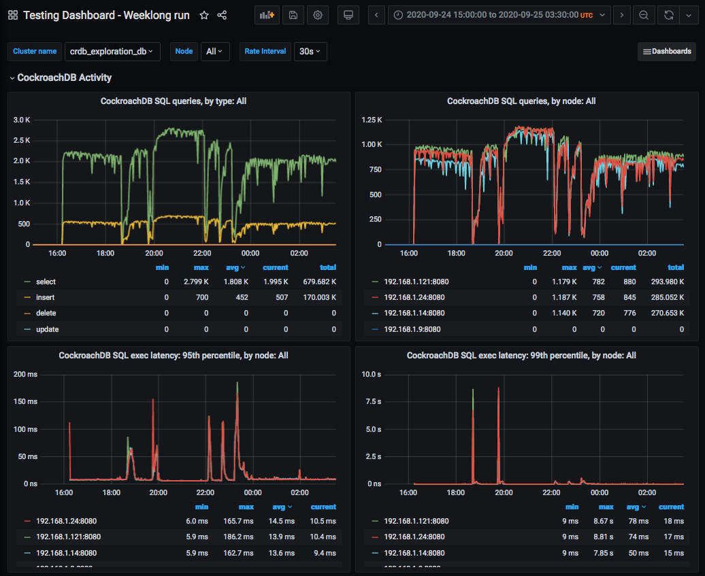

Similar to the large-database case: latency spikes and throughput crashes for the first few minutes, then throughput remains lower than before the event and latency higher.  This lasts 20-30 minutes and the cluster recovers.  There's no impact when we finally stop a node that's been decommissioned.

The larger-database case is more representative of a real workload.

On 2020-09-23 (the day previous), we had expanded the cluster from 3 nodes to 4 nodes while they were on "c4.large" instances using only 500 provisioned IOPS per node.  The behavior was similar, but the impact was even worse and lasted longer.  At this point we found that we seemed not to have as much IOPS capacity or memory as recommended and changed the configuration as described here.

=== Online expansion and contraction with a big database

On 2020-09-30 we tested online expansion and contraction using a much bigger database (i.e., one that does not fit in DRAM) and using local NVME devices rather than network storage.  To do this, we used the "i3.large" instance type (2 vCPUs, 15.25 GiB memory + 475 GiB NVME SSD).  Although the specific IOPS and I/O throughput are not documented, we expect them to be far more than CockroachDB's suggestion for this VCPU count.

We deployed a 3-node cluster and built up the database using one invocation of the following for _each_ node:

[source,text]
----
cockroach workload run kv --init --concurrency 4 --display-every=60s --batch 10 --max-block-bytes 1024 --min-block-bytes 1024 postgresql://root@192.168.1.53:26257/kv?sslmode=disable
----

This creates records of approximately 1 KiB in one giant table.  We stopped when the ZFS filesystem usage reached about 73.7 GiB per node (about 4-5x DRAM).  We checked the count of leaseholders and replicas:

For the actual testing, we ran this workload once for each cluster node:

[source,text]
----
cockroach workload run kv --max-block-bytes 1024 --min-block-bytes 1024 --histograms kv-histograms-$(date +%FT%TZ).out --concurrency 2 --display-every=60s --read-percent 80 --tolerate-errors postgresql://root@192.168.1.53:26257/kv?sslmode=disable
----

For this test, we brought up three more CockroachDB nodes, expanding the cluster from 3 nodes to 6 nodes.  We did this several minutes apart so the effect on performance would be clear.  Then we decommissioned these newly-added nodes, again several minutes apart, to see the impact.  Here's a timeline:

[source,text]
----
19:31Z Enabled CockroachDB node 4
21:09Z Enabled CockroachDB node 5
22:15Z Enabled CockroachDB node 6
22:26Z Increase load generator concurrency from 2 per node to 4 per node
22:44Z Reduce load generator concurrency back to 2 per node
22:58Z Begin decommissioning node 6 (took 11m)
23:26Z Begin decommissioning node 5 (took 23m)
23:47Z Begin decommissioning node 4 (took 23m)
----

Here's a summary of the performance impact:

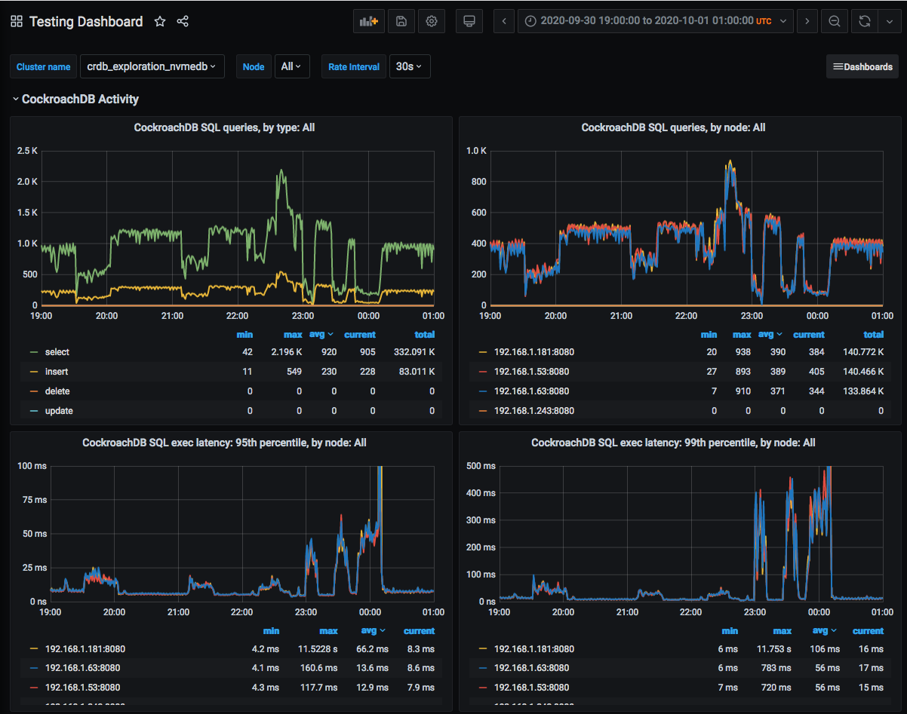

In nearly all cases where we added or removed a node (in this test and others), we see a significant increase in latency (and reduction in throughput) for the first 1-4 minutes, followed by a much longer period (20-30 minutes) of less severe but still considerable increase in latency and reduction in throughput (compared to before the operation).  We generally didn't see any client errors (but see below).

The count of replicas per node shows pretty clearly when each node was added, how long it took to rebalance storage, and when each node was subsequently removed, and how long the subsequent rebalancing took:

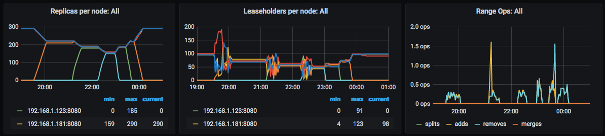

We also see this in disk space used:

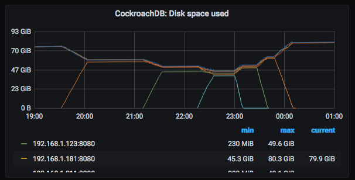

We can see that the CPU and disk utilization gets much more variable while rebalancing is going on:

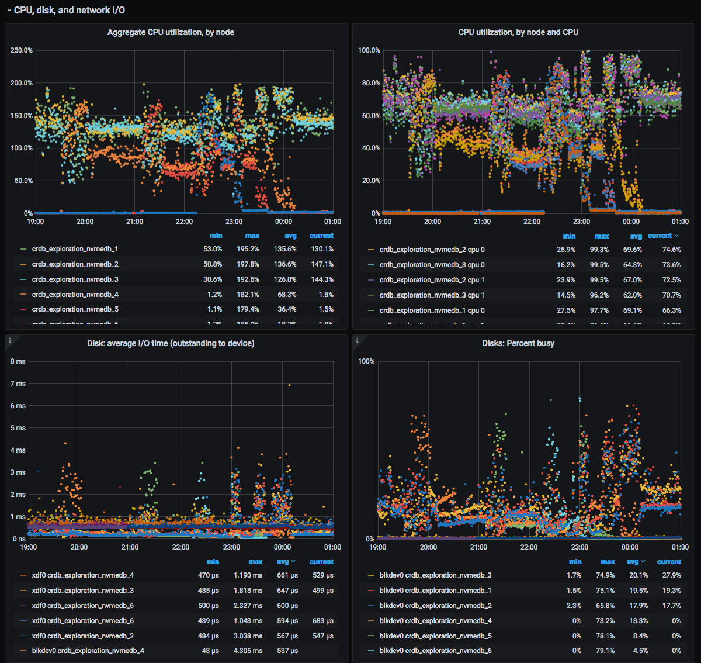

We can also see all the read and write activity that happens during rebalancing:

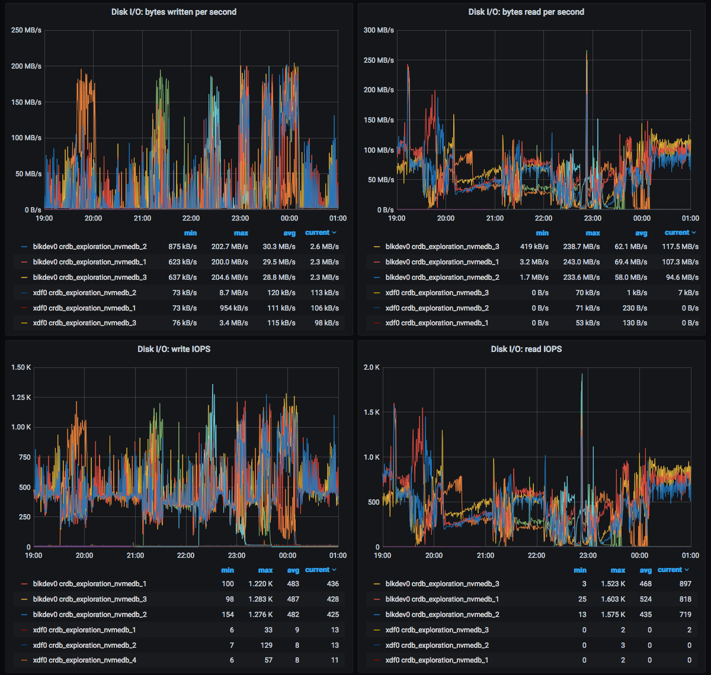

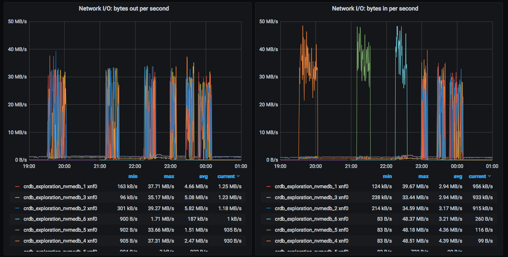

Through the whole process, the load generators reported a total of 3 failed queries:

[source,text]
----
E200930 23:08:39.587973 1 workload/cli/run.go:445  ERROR: result is ambiguous (error=unable to dial n5: breaker open [exhausted]) (SQLSTATE 40003)
...
E201001 00:08:29.690420 1 workload/cli/run.go:445  ERROR: result is ambiguous (error=unable to dial n1: breaker open [exhausted]) (SQLSTATE 40003)
----

It's not clear what caused these, but the impact was pretty small.

=== Fault testing

The fault testing was done on 2020-09-25 with a 5-node cluster with one "kv" workload runner pointed at each node in the cluster.  These were run as:

[source,text]
----
cockroach workload run kv --histograms kv-histograms-$(date +%FT%TZ).out --concurrency 2 --display-every=60s --read-percent 80 --tolerate-errors postgresql://root@192.168.1.14:26257/kv?sslmode=disable
----

Note that these are 1-byte writes (and likely 1-byte reads, though we might have also read some records written by previous tests using a few KiB values).

We ran the workload for four hours to see steady behavior before starting fault testing.  Before injecting faults, we see 0 errors, CPU utilization varying but largely under 80%, and disk utilization around 35%.

We ran several tests:

* Send SIGKILL (`kill -9`) to a CockroachDB process
* OS reboot
* OS panic
* Brief single-node network partition
* Extended single-node network partition

The impact on throughput and latency for all of these tests is shown here:

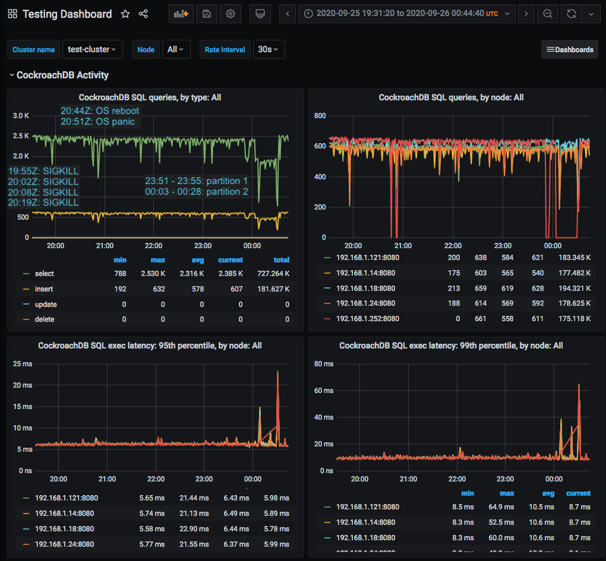

Note that these graphs do not show client-side latency or errors.  See the text below for details on that.

==== SIGKILL

SIGKILL immediately terminates a process, which causes the kernel to close open TCP connections.  This is a reasonable way to simulate a software crash of CockroachDB itself (and not any layers beneath it).  The program is running under SMF, so it gets restarted automatically when killed.

SIGKILL had very little impact on the cluster.  Each of the four times that we sent SIGKILL, there were several errors and a brief reduction in throughput, but no real impact on latency.

The load generator that was pointed at the node that was killed immediately reported 35 errors.  This is the `cockroach workload` output from that client around the failure:

[source,text]
----
_elapsed___errors__ops/sec(inst)___ops/sec(cum)__p50(ms)__p95(ms)__p99(ms)_pMax(ms)
...
14999.2s        0          436.5          465.8      2.6      5.8     10.0    113.2 read
14999.2s        0          110.1          116.6      5.8     11.0     19.9    159.4 write
E200925 19:55:45.182200 1 workload/cli/run.go:445  EOF
_elapsed___errors__ops/sec(inst)___ops/sec(cum)__p50(ms)__p95(ms)__p99(ms)_pMax(ms)
15059.1s       35          434.5          465.6      2.6      5.2      8.9   1811.9 read
15059.1s       35          108.2          116.5      5.8     10.5     16.8   1744.8 write
----

The EOF message makes sense for the failure mode.

Three of the four load generators aimed at _different_ nodes (that is, not the one that was killed) reported errors that looked like this:

[source,text]
----
E200925 20:02:20.514932 1 workload/cli/run.go:445  ERROR: result is ambiguous (error=unable to dial n7: breaker open [exhausted]) (SQLSTATE 40003)
...
15719.1s        1          472.9          482.1      2.5      5.0      8.9     67.1 read
15719.1s        1          118.7          120.6      5.5     10.0     16.3     92.3 write
E200925 20:08:15.107262 1 workload/cli/run.go:445  ERROR: result is ambiguous (error=unable to dial n7: breaker open [exhausted]) (SQLSTATE 40003)
15779.1s        3          461.9          482.1      2.5      5.0      8.1    184.5 read
15779.1s        3          114.3          120.5      5.5     10.0     16.3   2818.6 write
----

While a strange way to phrase the error (owing to Golang's choice), this appears to reflect a failure on the backend to contact the node that we killed.

In this case, no rebalancing was needed nor done by CockroachDB.

==== OS reboot

We used `uadmin 2 1` to induce an OS reboot at 20:44Z.  This is a graceful reboot in that filesystems are sync'd and TCP connections closed, but this does not wait long for processes to exit.

Here's the same graph of overall performance during all the fault testing:

This went well.  We do see a notable (brief) dip in throughput.  Queries served by the rebooted node dropped to zero, as we'd expect.  Clients reported the same kinds of errors as with the SIGKILL case: the client whose node was rebooted reported a bunch of EOF errors, while other clients saw a much smaller number of "breaker open" errors from within CockroachDB.  p95 rose from 6ms to 8ms and p99 rose from 8ms to 14ms, with a corresponding drop in throughput on all nodes.  This lasted 90 seconds from when the reboot was issued, 65 seconds of which were outside CockroachDB's control.  (That's the duration from when the reboot was issued until CockroachDB was started again, after the reboot.)  Keep in mind too that the graphs measure rates over 30 seconds, so the impact period while CockroachDB was running may have been considerably less than 25 seconds.

In this case, no rebalancing was needed nor done by CockroachDB.

==== OS panic

An OS panic causes the system to essentially stop running while the kernel writes a crash dump to disk, then the system reboots.  This looks similar to the OS reboot case except for the key difference that TCP connections are not closed.  Other hosts would see this as a partition until the OS came back up, at which point they would see explicit failures of these TCP connections when those other hosts next send any packets over them (which they generally must do occasionally to detect cases like this).

Here's the same graph of overall performance during all the fault testing:

This went well.  The period of impact is longer, presumably because of the crash dump.  It was about 1m49s from inducing the panic until CockroachDB was running.  Based on the latency and throughput graphs, performance was affected for another 1m11s.  Latency and throughput were affected similarly to the reboot: slightly elevated latency, slightly reduced throughput.

The client connected to the host that panicked reported:

[source,text]
----
18359.0s      262          381.2          508.4      2.4      4.7      8.1     56.6 read
18359.0s      262           94.2          127.1      5.5      9.4     14.2    109.1 write
E200925 20:52:09.494424 1 workload/cli/run.go:445  read tcp 192.168.1.219:55958->192.168.1.252:26257: read: connection reset by peer
18419.0s      398            0.0          506.7      0.0      0.0      0.0      0.0 read
18419.0s      398            0.5          126.7      0.5      0.9  51539.6  51539.6 write
E200925 20:53:09.901031 1 workload/cli/run.go:445  dial tcp 192.168.1.252:26257: connect: connection refused
18479.0s      783          156.2          505.6      2.6      5.5     10.5   2281.7 read
18479.0s      783           39.3          126.4      5.8     10.5     16.3   1342.2 write
18539.0s      783          485.5          505.5      2.4      5.2     10.0     75.5 read
18539.0s      783          122.0          126.4      5.5     10.5     18.9     88.1 write
18599.0s      783          501.6          505.5      2.4      4.7      7.9    121.6 read
18599.0s      783          123.2          126.4      5.5     10.0     17.8    100.7 write
----

These errors are consistent with an OS panic, although they imply that it was about a full minute between when the OS was up enough to issue an ECONNRESET and when CockroachDB was started.

In this case, no rebalancing was needed nor done by CockroachDB.

==== Transient single-node partition

We used firewall rules to simulate a network partition by blocking all traffic in and out on CockroachDB's port (26257), which is used for both SQL clients and intra-cluster traffic.

We induced a partition around one node from 23:51Z that lasted until 23:55Z, less than the 5-minute time after which CockroachDB would declare the node dead and rebalance data.  Admin UI immediately reports the correct node as "suspect" (which is the correct state here).

Several clients not pointed at the partitioned node report errors like this:

[source,text]
----
29158.4s      103          454.5          460.2      2.6      5.2      8.9     67.1 read
29158.4s      103          114.4          115.1      5.8     10.5     16.8     48.2 write
E200925 23:51:09.590144 1 workload/cli/run.go:445  ERROR: result is ambiguous (error=rpc error: code = Unavailable desc = transport is closing [exhausted]) (SQLSTATE 40003)
29218.4s      104          415.8          460.1      2.6      5.0      8.4   7247.8 read
29218.4s      104          103.6          115.1      5.8      9.4     15.7   7247.8 write
29278.4s      104          479.0          460.1      2.6      4.7      7.3     35.7 read
29278.4s      104          118.3          115.1      5.8      9.4     14.7     48.2 write
----

with an increase in max latency up to 7.2 seconds (that does not affect p99).

The load generator pointed at the partitioned node reports no more requests completing.  When the partition is removed, we see some very large max query times (103 seconds), and performance immediately goes back to what it was before:

[source,text]
----
_elapsed___errors__ops/sec(inst)___ops/sec(cum)__p50(ms)__p95(ms)__p99(ms)_pMax(ms)
29038.4s      783          501.8          503.0      2.5      4.7      8.4     54.5 read
29038.4s      783          124.8          125.8      5.5     10.0     15.7     50.3 write
29098.4s      783          504.1          503.0      2.5      4.7      7.9     54.5 read
29098.4s      783          127.1          125.8      5.2      9.4     15.2     50.3 write
29158.4s      783          233.9          502.5      2.5      5.0     10.0     67.1 read
29158.4s      783           57.9          125.6      5.5     10.5     18.9    113.2 write
29218.4s      783            0.0          501.5      0.0      0.0      0.0      0.0 read
29218.4s      783            0.0          125.4      0.0      0.0      0.0      0.0 write
29278.4s      783            0.0          500.4      0.0      0.0      0.0      0.0 read
29278.4s      783            0.0          125.1      0.0      0.0      0.0      0.0 write
...
29338.4s      783            0.0          499.4      0.0      0.0      0.0      0.0 read
29338.4s      783            0.0          124.9      0.0      0.0      0.0      0.0 write
29398.3s      783            0.0          498.4      0.0      0.0      0.0      0.0 read
29398.3s      783            0.0          124.6      0.0      0.0      0.0      0.0 write
_elapsed___errors__ops/sec(inst)___ops/sec(cum)__p50(ms)__p95(ms)__p99(ms)_pMax(ms)
29458.3s      783          406.7          498.2      2.5      4.7      7.6 103079.2 read
29458.3s      783          104.5          124.6      5.5      9.4     14.7 103079.2 write
29518.3s      783          499.4          498.2      2.5      4.7      7.9    125.8 read
29518.3s      783          124.3          124.6      5.5      9.4     16.3     79.7 write
----

It surprising at first that p99 never rose.  This might be because latency is reported only for completed queries.  When the partition starts, a few queries get stuck, but it may be less than 1% during that 1-minute sampling window.  When the partition finishes, queries are fast, and any that were stuck might represent less than 1 minute in the next window.  Intuitively we'd expect all queries during the window to have elevated latency, but if they weren't completing, they might not be reported -- these might be the 103-second queries we see at the end of the window.  Why only 103 seconds?  That's harder to understand.  This all relies on a lot of "maybe", but we'd probably need more precise client-side metrics to really see what was going on here.

Here's the same graph of overall performance during all the fault testing:

As we'd expect, queries per second handled by the partitioned node went to zero for the duration of the partition.  (Note that Prometheus would have been able to scrape all metrics from this node during this period because those are exposed over a different TCP port that we did not firewall.)  All nodes' CPU usage, disk throughput, and query throughput went down a little bit.  This seems likely a result of one load generator being off rather than one node being down.

==== Extended single-node partition

We used the same approach to induce a partition around the same node from 00:03Z until 00:28Z.  This is long enough that CockroachDB should declare the node dead around 00:08Z.  This should cause it to rebalance (create new replicas to replace the ones that were on that node).  At 00:28Z, we'd expect it to do more rebalancing to put replicas onto the newly-recovered node.

As expected, this looks similar to the transient partition for a while, with similar errors reported by the client whose node is partitioned:

[source,text]
----
29758.3s      783          124.8          124.6      5.5     10.0     15.7     44.0 write
29818.3s      783          437.9          498.1      2.4      5.0      9.4    134.2 read
29818.3s      783          111.8          124.5      5.5     12.6     96.5    352.3 write
29878.3s      783          276.7          497.6      2.5      5.0      8.4     33.6 read
29878.3s      783           71.1          124.4      5.5      9.4     14.2     75.5 write
29938.3s      783            0.0          496.6      0.0      0.0      0.0      0.0 read
29938.3s      783            0.0          124.2      0.0      0.0      0.0      0.0 write
29998.3s      783            0.0          495.6      0.0      0.0      0.0      0.0 read
29998.3s      783            0.0          123.9      0.0      0.0      0.0      0.0 write
_elapsed___errors__ops/sec(inst)___ops/sec(cum)__p50(ms)__p95(ms)__p99(ms)_pMax(ms)
30058.3s      783            0.0          494.6      0.0      0.0      0.0      0.0 read
30058.3s      783            0.0          123.7      0.0      0.0      0.0      0.0 write
30118.3s      783            0.0          493.7      0.0      0.0      0.0      0.0 read
30118.3s      783            0.0          123.4      0.0      0.0      0.0      0.0 write
30178.3s      783            0.0          492.7      0.0      0.0      0.0      0.0 read
30178.3s      783            0.0          123.2      0.0      0.0      0.0      0.0 write
E200926 00:08:49.992643 1 workload/cli/run.go:445  read tcp 192.168.1.219:44348->192.168.1.252:26257: read: connection timed out
30238.3s      787            0.0          491.7 103079.2 103079.2 103079.2 103079.2 read
30238.3s      787            0.0          122.9 103079.2 103079.2 103079.2 103079.2 write
30298.3s      787            0.0          490.7      0.0      0.0      0.0      0.0 read
30298.3s      787            0.0          122.7      0.0      0.0      0.0      0.0 write
30358.3s      787            0.0          489.7      0.0      0.0      0.0      0.0 read
30358.3s      787            0.0          122.5      0.0      0.0      0.0      0.0 write
E200926 00:12:32.150330 1 workload/cli/run.go:445  dial tcp 192.168.1.252:26257: connect: connection timed out
30418.3s      789            0.0          488.8      0.0      0.0      0.0      0.0 read
30418.3s      789            0.0          122.2 103079.2 103079.2 103079.2 103079.2 write
----

As before, other clients report the same error as before and a few multi-second latency outliers, beyond the p99:

[source,text]
----
29818.3s      104          115.3          115.1      5.8     10.0     16.3     62.9 write
29878.3s      104          402.2          460.0      2.6      5.8     10.0    285.2 read
29878.3s      104           99.2          115.1      5.8     13.1    104.9    402.7 write
E200926 00:03:13.840994 1 workload/cli/run.go:445  ERROR: result is ambiguous (error=rpc error: code = Unavailable desc = transport is closing [exhausted]) (SQLSTATE 40003)
29938.3s      105          415.9          459.9      2.6      5.0      7.6   6174.0 read
29938.3s      105          103.9          115.0      5.8     10.0     15.7   6174.0 write
29998.3s      105          465.7          459.9      2.6      5.0      7.9     52.4 read
29998.3s      105          118.8          115.1      5.8      9.4     15.2     48.2 write
_elapsed___errors__ops/sec(inst)___ops/sec(cum)__p50(ms)__p95(ms)__p99(ms)_pMax(ms)
30058.3s      105          474.7          459.9      2.6      4.7      7.3     27.3 read
30058.3s      105          119.4          115.1      5.5      9.4     13.6     28.3 write
30118.3s      105          465.4          459.9      2.6      5.0      8.9    109.1 read
30118.3s      105          115.6          115.1      5.8     10.0     17.8     60.8 write
30178.3s      105          284.7          459.6      2.9     11.5     22.0   2684.4 read
30178.3s      105           71.3          115.0      6.0     18.9     46.1   2550.1 write
30238.3s      105          226.6          459.1      4.1     13.1     25.2   1275.1 read
30238.3s      105           56.2          114.9      8.1     27.3     88.1    570.4 write
30298.3s      105          409.1          459.0      3.0      6.3     11.5    100.7 read
30298.3s      105           99.5          114.8      6.0     11.0     16.8     96.5 write
30358.3s      105          447.3          459.0      2.8      5.2      8.1     50.3 read
30358.3s      105          111.1          114.8      5.8      9.4     14.2     32.5 write
----

It's a little surprising that things got better for several minutes and then we saw a few multi-second outliers again.

Other graphs showed a lot of rebalancing activity.  Check out CPU utilization and disk utilization from 00:08 to 00:28:

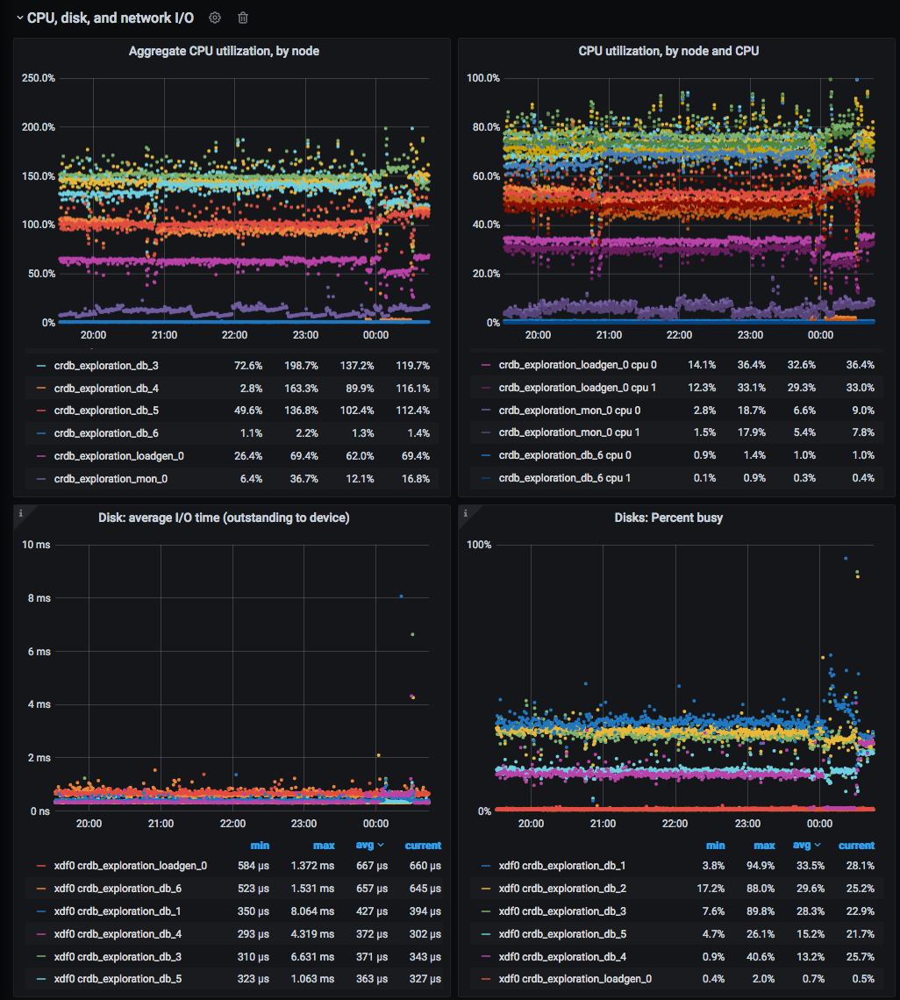

There's also a bit less disk write activity and a lot more reads (presumably reading cold data from disk in order to send it to a node that's going to host a new replica):

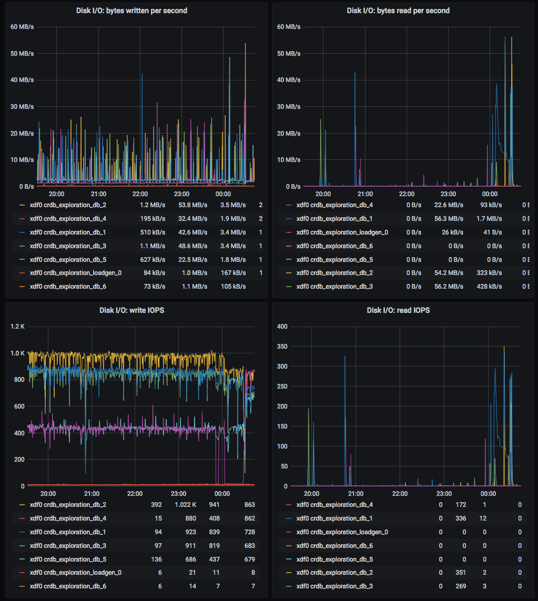

We also see ranges and leaseholders moving around:

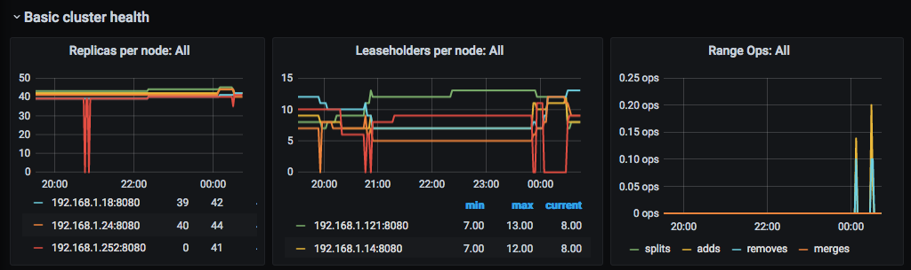

At 00:20, we dumped information about the ranges from the "kv" database:

[source,text]
----
root@192.168.1.24:26257/defaultdb> select (range_id, lease_holder, replicas) from [show ranges from database kv];
       ?column?
----------------------
  (55,3,"{2,3,7}")
  (67,3,"{2,3,7}")
  (85,7,"{2,3,7}")
  (77,12,"{2,7,12}")
  (83,2,"{2,3,7}")
  (84,2,"{2,3,7}")
  (69,7,"{2,7,12}")
  (62,7,"{2,3,7}")
  (79,3,"{2,3,12}")
  (76,12,"{3,7,12}")
  (90,12,"{2,3,12}")
(11 rows)
----

We partitioned node 11, and CockroachDB has correctly established 3 replicas on nodes _not_ including 11.

After the partition was removed, we see some replicas landed back on node 11:

[source,text]
----
root@192.168.1.24:26257/defaultdb> select (range_id, lease_holder, replicas) from [show ranges from database kv];
       ?column?
-----------------------
  (55,2,"{2,3,11}")
  (67,7,"{7,11,12}")
  (85,2,"{2,3,7}")
  (77,12,"{2,11,12}")
  (83,3,"{2,3,7}")
  (84,7,"{3,7,11}")
  (69,12,"{2,7,12}")
  (62,11,"{2,7,11}")
  (79,3,"{2,3,12}")
  (76,3,"{3,11,12}")
  (90,11,"{2,11,12}")
(11 rows)

Time: 122.942376ms
----

Here's the same graph of overall performance during all the fault testing:

The overall impact was a bit bigger than we'd like:

* p95 bumped up from about 6ms to about 25ms
* p99 bumped up from about 10ms to about 90ms
* There was a particular dip in throughput when the node came back, down to 800 selects (from 1900) and 200 inserts (from 470).  That lasted about 3 minutes.  This is consistent with other testing we did when rebalancing happened.
* p99 RTT latency rose as high as 1.75s and p99 heartbeat latency hit 10s -- but those 10s data points are all for the partitioned node.  10s seems like some hardcoded max.

=== Long-running "kv" workload

The long-running workload continued on the same cluster and database used for the fault testing above.  This was a 5-node cluster at that point.  We ran this workload once for each cluster node:

[source,text]
----
cockroach workload run kv --histograms kv-histograms-$(date +%FT%TZ).out --concurrency 4 --display-every=60s --read-percent 80 --tolerate-errors postgresql://root@192.168.1.14:26257/kv?sslmode=disable
----

This ran from about 2020-09-26T01:00Z to 2020-10-05T15:00Z (9d 14h, or 240 hours).

We were primarily looking for crashes in performance, especially permanent ones, or an overall negative trend in throughput.  There was more variation than we might like, and there are some transient spikes in latency (with associated crashes in throughput), but p99 only reached about 40ms:

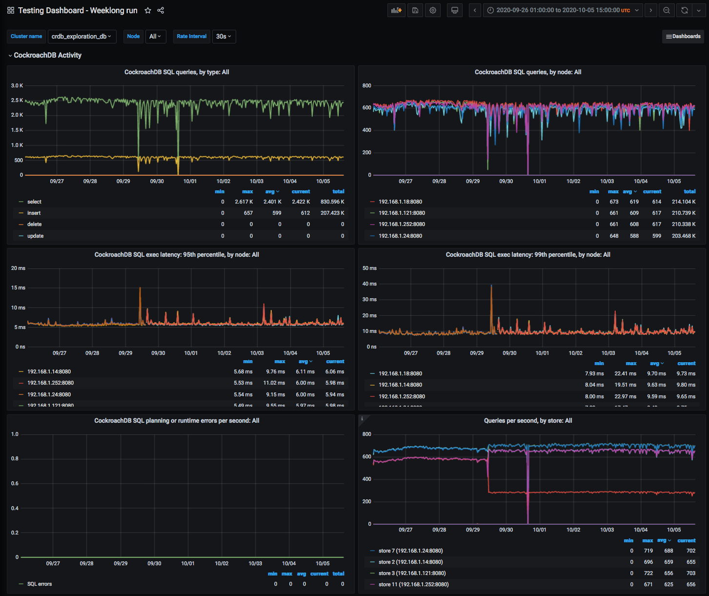

The change in queries per store on 9/29 is interesting, but we did not dig into it.

== Other lessons learned

As part of this work, we also learned a bunch about AWS, largely related to I/O performance.

The typical baseline EBS volume is "gp2" class, a general-purpose SSD-based network volume.  We initially used these volumes for testing because it's fairly cheap and we weren't intending to measure absolute performance.  https://docs.aws.amazon.com/AWSEC2/latest/UserGuide/ebs-volume-types.html#EBSVolumeTypes_gp2[gp2 volumes provide a certain number of IOPS depending mostly on the volume's size]; what's tricky, though, is that they also support bursting way above their baseline performance, and worse (for our use case): they start with a significant "credit" ostensibly to speed up boot time, which might use more I/O than steady-state.  They can run significantly faster for the first several _hours_ than they will after that.  It took some time for us track this down as the cause of suddenly-dropping database performance.

To avoid bursting, we switched to more expensive https://docs.aws.amazon.com/AWSEC2/latest/UserGuide/ebs-volume-types.html#EBSVolumeTypes_piops["io1" class volumes], which provide more consistent performance at whatever level you specify.  We also did some testing using EC2 instance types with directly-attached NVME storage ("i3" instance types).  Those are nominally cheaper, but all data is lost when the instance is shut down, so it needs to remain running 24/7 as long as the cluster might ever remain in use, so it winds up being more expensive for this sort of testing.

[bibliography]
== References

There are many links in the text above (that are not included here) to official CockroachDB and AWS documentation.

* [[[rfd26, RFD 26]]] https://26.rfd.oxide.computer/[RFD 26 Host Operating System & Hypervisor]
* [[[rfd48, RFD 48]]] https://48.rfd.oxide.computer/[RFD 48 Control Plane Architecture]
* [[[rfd53, RFD 53]]] https://53.rfd.oxide.computer/[RFD 53 Control plane data storage requirements]
* [[[CockroachDB-Jepsen-Report, Jepsen report on CockroachDB]]] http://jepsen.io/analyses/cockroachdb-beta-20160829[Jepsen report on CockroachDB]
* [[[NewSQL-notes, Notes on NewSQL Databases]]] https://github.com/oxidecomputer/meta/blob/master/engineering/Notes-on-NewSQL-distributed-databases.adoc[Notes on NewSQL databases]
